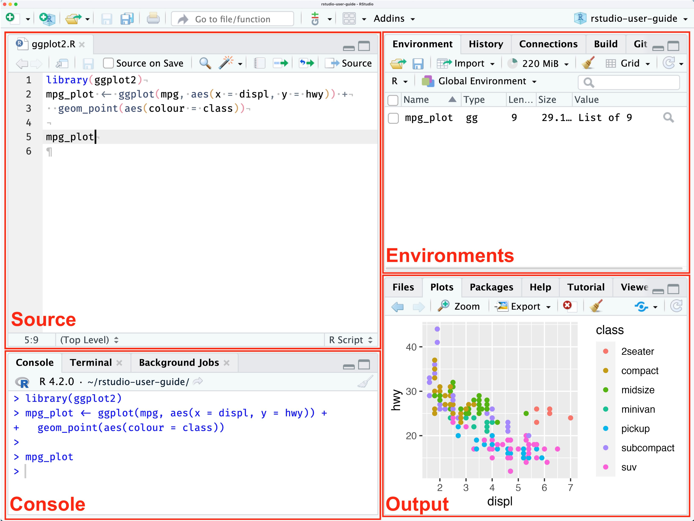

## Introduction

Welcome to our course on single-cell RNA sequencing (scRNA-seq) analysis using R! This course is designed for beginners with no prior R programming experience. We'll guide you through the process of analyzing scRNA-seq data using R, with a focus on the `Seurat` and `SeuratExtend` packages as our primary analytical framework.

### What is R?

R is an open-source programming language specifically designed for statistical computing and graphics. It's widely used in bioinformatics and single-cell analysis due to its extensive collection of packages and large user community.

### Setting Up Your Environment

To make using R easier and more productive, we recommend using RStudio, an integrated development environment (IDE) for R.

### Installing R and RStudio

Follow these steps to set up your environment:

1. Visit https://posit.co/download/rstudio-desktop/
2. Choose the version suitable for your operating system (Windows, Mac, or Linux)
3. Follow the prompts to download and install R first, then RStudio
4. Once installed, open RStudio to begin programming

### RStudio Interface

Here's a brief explanation of the RStudio interface:



1. **Source Editor**: Write and edit your R scripts here
2. **Console**: Run R commands and see output
3. **Environment**: View your current variables and data
4. **Files/Plots/Packages/Help**: Access files, view plots, manage packages, and get help

In this course, we provide two types of files for you to use:

1. **R files (.R)**: These are plain text files containing R code. They're ideal for writing and running scripts.
2. **R Markdown files (.Rmd)**: These combine R code with formatted text, allowing you to create dynamic reports.
   - To use: Open in RStudio, write text and R code in chunks, then 'Knit' to generate a formatted output (e.g., HTML, PDF).

We recommend setting your working directory to the folder containing all the course materials. You can do this in two ways:

1. Using the `setwd()` function in R:
```{r, eval=FALSE}
setwd("/path/to/your/course/folder")
```
   Replace "/path/to/your/course/folder" with the actual path to your downloaded course materials.

2. Using RStudio's interface:
   - Go to Session > Set Working Directory > Choose Directory
   - Navigate to and select your course folder
   - Click 'Open'

Setting your working directory ensures that R can easily find and access all the files you'll be using throughout the course.

## Basic R Programming

Let's start with some fundamental concepts in R programming:

### 1. Basic Arithmetic

R can be used as a simple calculator. Try running these commands in the console:

```{r}
2 + 3  # Addition
10 - 4  # Subtraction
5 * 2  # Multiplication
20 / 4  # Division
2^3  # Exponentiation
```

### 2. Variable Assignment

Variables allow you to store and manipulate data:

```{r}
x <- 10  # Assign value 10 to variable x
x

y <- 5   # Assign value 5 to variable y
y

z <- x + y  # Assign the sum of x and y to z
print(z)  # Print the value of z
```

### 3. Basic Data Types

R has several basic data types. Here are the three most fundamental ones:

```{r}
# Numeric (for numbers)
num <- 10.5
class(num)

# Character (for strings)
char <- "Hello"
class(char)

# Logical (for boolean values TRUE or FALSE)
log <- TRUE
class(log)
```

Logical (boolean) variables are often used for filtering data. For example, you might use them to extract cells where a certain gene's expression is above a threshold, or to select samples under specific conditions. We'll explore this further in later lessons.

### 4. Vectors

In R, vectors are one of the most fundamental data structures. We've already created vectors with single elements, but vectors can contain multiple elements of the same type.

To create a vector with multiple elements, we use the `c()` function (c stands for combine):

```{r}
# Numeric vector
numbers <- c(1, 2, 3, 4, 5)
numbers

# Character vector
fruits <- c("apple", "banana", "cherry")
fruits

# Boolean vector
bool_vec <- c(TRUE, FALSE, TRUE, TRUE)
bool_vec
```

R provides a simple way to create a sequence of numbers:

```{r}
# Creates a vector of numbers from 1 to 10
seq_numbers <- 1:10
seq_numbers
```

### 5. Logical Operators

Let's start by learning how to compare numbers:

```{r}
a <- 5
b <- 7

# Comparison operators
a < b   # Less than
a <= b  # Less than or equal to
a > b   # Greater than
a >= b  # Greater than or equal to
a == b  # Equal to
a != b  # Not equal to
```

We can also combine multiple conditions using logical operators:

```{r}
# Logical operations
(a > 3) | (b > 10)  # TRUE if at least one condition is true
(a > 3) & (b < 10)  # TRUE if both conditions are true
```

Here, we introduce the logical operators AND (`&`) and OR (`|`). These operate on boolean values. Another important logical operator is NOT (`!`). These concepts are crucial and we'll explore their applications further in later lessons.

### 6. Retrieving Elements from Vectors

Retrieving elements is a fundamental operation in data manipulation. There are three main methods: using index, using logical vectors for indexing, and using names. Let's explore each:

#### Using Index

```{r}
numbers <- c(10, 20, 30, 40, 100)   # Create a numeric vector
numbers[3]  # Get the third element
numbers[c(1, 3, 5)]  # Get the first, third, and fifth elements
numbers[2:4]  # Get elements from index 2 to 4
```

#### Using Logical Vector for Indexing

```{r}
numbers[c(TRUE, FALSE, TRUE, FALSE, TRUE)]
```

This selects the 1st, 3rd, and 5th elements where TRUE appears. This method is powerful when combined with logical expressions. For example, to get elements greater than 30:

```{r}
numbers[numbers > 30]
```

Let's break down this expression:

```{r}
# First, we create a logical vector
numbers > 30

# Then we use this logical vector to select elements
numbers[numbers > 30]
```

In practice, we often need to combine multiple conditions. This is where `&`, `|`, and `!` come in handy. For example, to select elements between 25 and 50:

```{r}
numbers[numbers > 25 & numbers < 50]
```

For beginners, let's break this down step-by-step:

```{r}
# Which elements are greater than 25?
high_expr <- numbers > 25
high_expr

# Which elements are less than 50?
low_expr <- numbers < 50
low_expr

# Combine conditions with AND (&)
high_and_low_expr <- high_expr & low_expr
high_and_low_expr

# Use this logical vector to select elements
numbers[high_and_low_expr]
```

You can experiment with `|` and `!` in a similar manner.

#### Vector Operations with Names

We can also create named vectors and use names to retrieve elements:

```{r}
# Creating a named vector
gene_expr <- c(gene1 = 100, gene2 = 200, gene3 = 150, gene4 = 300)
print(gene_expr)

# Accessing elements by name
gene_expr["gene2"]

# Accessing multiple elements by name
gene_expr[c("gene1", "gene3")]
```

### 7. Changing and Removing Elements

You can modify vectors by changing, removing, or adding elements:

```{r}
# Change the second element to 1000
numbers[2] <- 1000
numbers

# Remove the third element
numbers <- numbers[-3]
numbers

# Add new elements to the end of the vector
numbers <- c(numbers, 60, 70)
numbers

# Add a new named element
gene_expr["gene5"] <- 250
gene_expr

# Change an element by name
gene_expr["gene2"] <- 180
gene_expr
```


### 8. Installing and Loading Packages

While base R provides many functionalities, we often need additional packages to perform specific tasks, especially in bioinformatics and scRNA-seq analysis. Here's how you can install and load packages:

#### Installing a package from CRAN

To install a package from CRAN (The Comprehensive R Archive Network), you can use the `install.packages()` function. For example, to install the popular data visualization package `ggplot2`:

```{r}
# install.packages("ggplot2")
```

Note: We've commented out this code as we won't run it during the class, but this is how you would typically install a package.

#### Loading a package

Once a package is installed, you need to load it into your R session to use its functions:

```{r}
# library(ggplot2)
```

#### Installing a Bioconductor package

Bioconductor is a repository for bioinformatics packages. To install a Bioconductor package, you first need to install the `BiocManager` package:

```{r}
# if (!requireNamespace("BiocManager", quietly = TRUE))
#   install.packages("BiocManager")
# BiocManager::install("DESeq2")
```

#### Loading a Bioconductor package

Once installed, you can load a Bioconductor package just like any other package:

```{r}
# library(DESeq2)
```

### 9. Getting Help

R provides built-in help documentation for its functions. This is crucial when you're learning how to use a new function or need to remind yourself of the details of a function you've used before.

There are two main ways to access help in R:

```{r}
# Getting help for a function
?mean
help(mean)
```

Both of these commands will open the help page for the `mean` function, which includes a description of what the function does, its arguments, and often examples of how to use it.

### 10. Data Frames

Data frames are table-like structures that are commonly used in R for storing and manipulating data. They are particularly useful because they can contain different types of data (numeric, character, logical) in different columns.

Key properties of data frames:
- Each column must contain the same type of data (e.g., numeric, character)
- Each row represents an observation or case
- Column names must be unique

Let's create a simple data frame and explore its properties:

```{r}
# Creating a data frame
df <- data.frame(
  sample = c("sample1", "sample2", "sample3", "sample4"),
  expression = c(100, 200, 150, 300),
  condition = c("control", "treatment", "control", "treatment")
)
print(df)

# Dimensions of a data frame
dim(df)
nrow(df)
ncol(df)

# Column names
colnames(df)
```

#### Accessing and Subsetting Data Frames

There are several ways to access data in a data frame:

```{r}
# Accessing columns
df$sample
df[["sample"]]
df["sample"]  # Returns a data frame

# Subsetting a data frame
df[1:2, 2:3] # Row 1 and 2, column 2 and 3
df[1, ]  # First row, all columns
df[df$condition == "control", c("sample", "condition")] # Control sample rows, "sample" and "condition" columns
```

#### Modifying Data Frames

We can add new columns or rows to a data frame, or modify existing values:

```{r}
# Adding a new column
df$log_expression <- log2(df$expression)
df

# Adding a new row
new_row <- data.frame(sample = "sample5", expression = 250, condition = "control", log_expression = log2(250))
df <- rbind(df, new_row)
df

# Changing specific values in a data frame
df[df$condition == "control", "condition"] <- "C"
df[df$condition == "treatment", "condition"] <- "T"
print(df)
```

### 11. Matrices

Matrices are similar to data frames in that they are two-dimensional, but they have one key difference: all elements in a matrix must be of the same data type (usually numeric).

```{r}
# Creating a matrix
m <- matrix(1:12, nrow = 3, ncol = 4)
print(m)

# Adding row and column names
rownames(m) <- c("gene1", "gene2", "gene3")
colnames(m) <- c("cell1", "cell2", "cell3", "cell4")
print(m)
```

#### Matrix Operations

Matrices support various mathematical operations:

```{r}
# Matrix operations
t(m)  # Transpose
m * 2  # Element-wise multiplication

# Applying functions to rows or columns
colSums(m)
rowMeans(m)
```

#### Subsetting Matrices

Like data frames, matrices can be subsetted:

```{r}
# Subsetting a matrix
m[1, ]  # First row
m[, 2]  # Second column
m[1:2, 3:4]  # Submatrix
m[c("gene1","gene3"), c(2,4)]  # Submatrix
```

In the context of single-cell RNA sequencing analysis, matrices are often used to represent gene expression data, where rows typically represent genes and columns represent cells. Understanding how to manipulate these structures is crucial for effective data analysis in bioinformatics.

### 12. Factors

Factors are a special type of vector in R that are used to represent categorical data. They are similar to vectors but are limited to a predefined set of values, called levels.

```{r}
# Creating a factor
symptoms <- factor(c("mild", "severe", "mild", "moderate", "moderate"))
print(symptoms)

# Levels of a factor
levels(symptoms)

# Changing levels
levels(symptoms) <- c("M", "Mo", "S")
print(symptoms)

# Using factors in data analysis
counts <- table(symptoms)
counts
```

One important application of factors in data visualization is ordering. We can change the order of factor levels without changing the factor's content:

```{r}
# Example of how factor level order affects plotting
counts <- table(symptoms)
barplot(counts, main="Symptom Severity", xlab="Severity Level")

# Changing the order of levels
symptoms_reordered <- factor(symptoms, levels = c("S", "Mo", "M"))
print(symptoms_reordered)

# Changing the order for a different visualization
counts_reordered <- table(symptoms_reordered)
barplot(counts_reordered, main="Symptom Severity (Reordered)", xlab="Severity Level")
```

### 13. Lists

Lists in R are versatile data structures that can contain elements of different types, including other lists.

```{r}
# Creating a list
patient <- list(
  id = "PT001",
  age = 45,
  symptoms = c("fever", "cough"),
  test_results = data.frame(
    test = c("PCR", "Antibody"),
    result = c("Positive", "Negative")
  )
)
print(patient)

# Accessing list elements
patient$id
patient[["age"]]
patient[[3]]

# Adding to a list
patient$medication <- c("Aspirin", "Cough Syrup")
print(patient)

# Nested list operations
patient$test_results$result
```

### 14. If-Else Statements

If-else statements allow you to execute different code blocks based on certain conditions.

```{r}
# Example 1: Checking gene expression levels
gene_expression <- 100

if (gene_expression > 50) {
  print("High expression")
} else {
  print("Low expression")
}

# Example 2: Classifying cells based on marker gene expression
cd4_expression <- 80
cd8_expression <- 20

if (cd4_expression > 50 & cd8_expression < 30) {
  print("This cell is likely a CD4+ T cell")
} else if (cd8_expression > 50 & cd4_expression < 30) {
  print("This cell is likely a CD8+ T cell")
} else {
  print("Cell type is uncertain")
}
```

### 15. Basic For Loops in R for scRNA-seq Analysis

For loops are used when we need to repeat a series of operations multiple times. For example, we might need to read sequencing data for 20 samples. Instead of copying and pasting the same code 20 times and manually changing each value, we can use a loop.

The basic format of a for loop is:

```r
for (variable in sequence) {
  # code to be repeated
}
```

Here are some examples:

```{r}
# Example 1: Printing numbers from 1 to 5
for (i in 1:5) {
  print(i)
}

# Example 2: Calculating mean expression for multiple genes
genes <- c("GENE1", "GENE2", "GENE3", "GENE4")
expression_values <- list(
  GENE1 = c(10, 20, 15, 25),
  GENE2 = c(50, 60, 55, 65),
  GENE3 = c(5, 8, 6, 7),
  GENE4 = c(100, 120, 110, 130)
)
print(expression_values)

for (gene in genes) {
  mean_expression <- mean(expression_values[[gene]])
  cat("Mean expression of", gene, ":", mean_expression, "\n")
}
```

In this last example, we're iterating over a list of genes, calculating the mean expression for each gene, and printing the results. This demonstrates how loops can be used to perform repetitive tasks efficiently in the context of gene expression analysis.

### 16. Working with File Paths

In many cases, we need to interact with files on our hard drive. This could be for reading large external datasets (like CSV files downloaded from the GEO database) or exporting our analysis results to files (CSV or Excel). Understanding how to work with file paths is crucial for these operations.

```{r}
# Get current working directory
current_dir <- getwd()
print(current_dir)

# Set working directory
# setwd("/path/to/your/directory")  # Uncomment and modify as needed

# Construct file paths
results_dir <- "results"
csv_file <- file.path(results_dir, "gene_expression.csv")
print(csv_file)

# Create the 'results' directory if it doesn't exist
if (!dir.exists(results_dir)) {
  dir.create(results_dir)
  print(paste("Created directory:", results_dir))
}
```

### 17. Writing and Reading CSV Files

CSV (Comma-Separated Values) files are a common format for storing tabular data. R provides functions to easily read from and write to CSV files.

```{r}
# Create a sample data frame to write
gene_data <- data.frame(
  gene_id = c("GENE1", "GENE2", "GENE3", "GENE4"),
  expression_level = c(10.5, 20.3, 15.7, 30.2),
  p_value = c(0.001, 0.05, 0.01, 0.001)
)
print(gene_data)

# Write the data frame to a CSV file
write.csv(gene_data, file = csv_file, row.names = FALSE)
print(paste("Data written to CSV file:", csv_file))

# Read the CSV file we just created
read_data <- read.csv(csv_file)
print(read_data)

# Read a specific number of rows
gene_data_head <- read.csv(csv_file, nrows = 2)
print("First 2 rows of data:")
print(gene_data_head)
```

### 18. Writing and Reading RDS Files

While CSV is a text-based format that can store tabular data, many R objects cannot be easily converted to text. For these cases, R provides the RDS (R Data Serialization) format, which can store any R object.

```{r}
# Write the data frame to an RDS file
rds_file <- file.path(results_dir, "gene_expression.rds")
saveRDS(gene_data, file = rds_file)
print(paste("Data written to RDS file:", rds_file))

# Read the RDS file we just created
read_rds_data <- readRDS(rds_file)
print(read_rds_data)
```

RDS files are particularly useful when working with complex R objects, such as large data frames, lists, or custom objects that you want to save and reload later without losing any information or structure.

## Conclusion and Next Steps

Congratulations! You have completed the preparatory work for learning R programming. Our next step will be to dive into single-cell analysis. To begin this journey, we need to install the Seurat package, which is a powerful toolkit for single-cell genomics.

```{r, eval=FALSE}
install.packages("Seurat")
```

Note: If you've never used related R packages before, you might be prompted to install Rtools (on Windows). You can download the appropriate version from the official website following these instructions:
https://cran.rstudio.com/bin/windows/Rtools/

### Tips for Learning R

A crucial skill in R programming is the ability to search documentation and find help resources. Once you understand these basic principles, you don't need to memorize the spelling of every function name or the usage of every parameter - that would be nearly impossible given the vast number of functions and parameters you'll encounter.

The key is knowing how to find these functions and their corresponding usage. In this course, we introduced the use of `?` to display help documentation. Official package websites often have tutorials for reference.

Moreover, the rise of large language models has significantly changed the game. They can help you quickly and easily master a language with remarkable efficiency. You can ask any question to a chatbot, and it will provide you with detailed explanations. We recommend Claude and ChatGPT:

- [Claude](https://claude.ai/)
- [ChatGPT](https://chatgpt.com/)

Remember, the journey of learning R and bioinformatics is ongoing. As you progress, you'll find that your ability to solve problems and find information improves. Don't be discouraged if you encounter difficulties - they're a natural part of the learning process.

In our next lesson, we'll start exploring the Seurat package and begin our journey into single-cell RNA sequencing analysis. Get ready for an exciting adventure in the world of bioinformatics!
