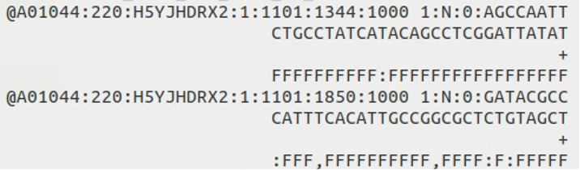
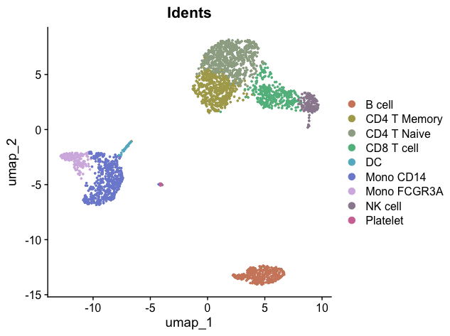
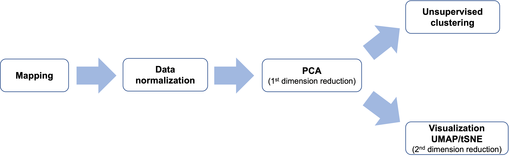
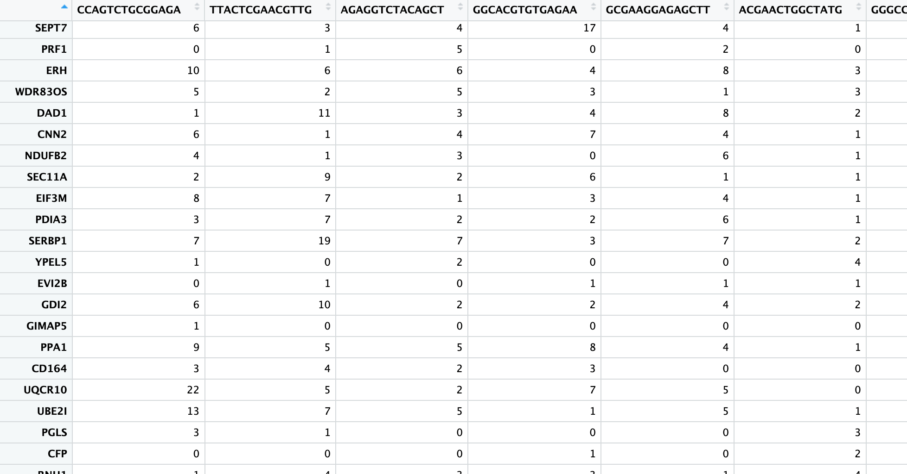
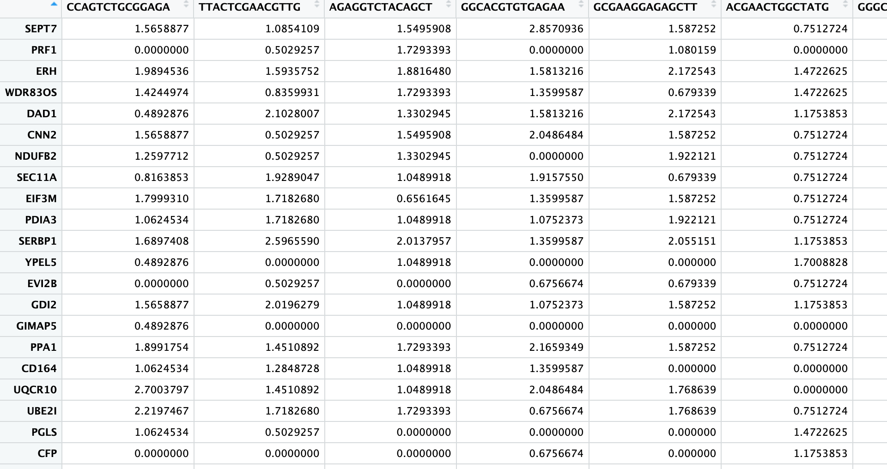
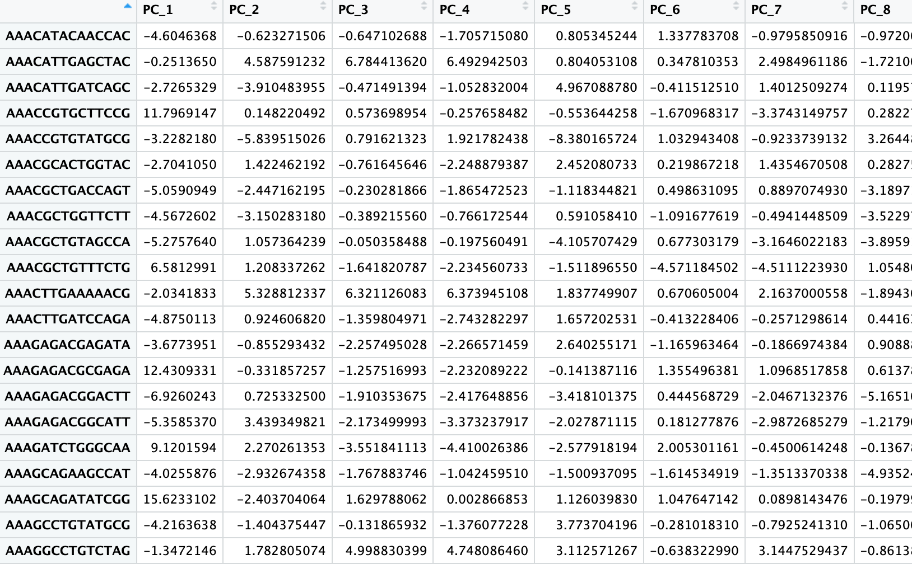
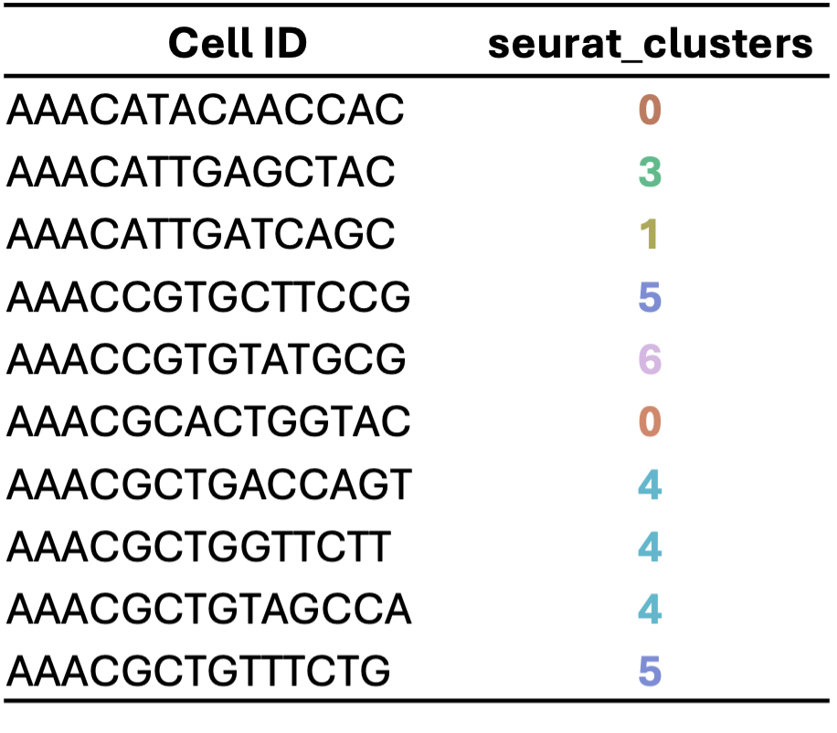
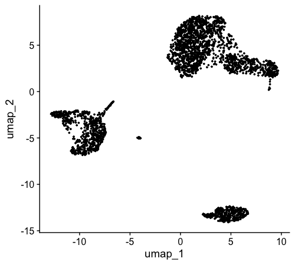
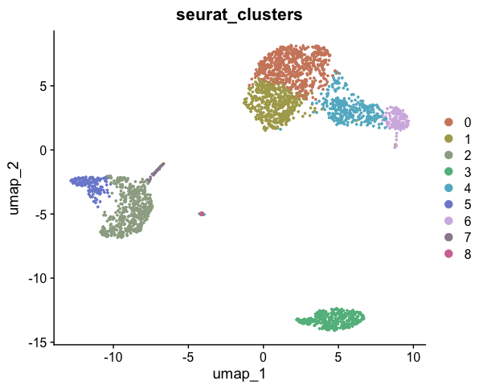

## Introduction to Single-Cell Analysis with Seurat

Seurat is the most popular framework for analyzing single-cell data in R. It provides structured data storage, basic analysis workflows, and visualization solutions. Before we dive into the code, let's introduce some fundamental concepts and principles of single-cell data analysis. This background will help us better understand the process.

### From Raw Data to Visualization: The Single-Cell Analysis Journey

When we first receive sequencing data, it's typically in the form of FASTQ files. These are text files that contain the raw nucleotide sequences. A typical FASTQ file looks like this:

{width=500px}

A key milestone in our single-cell analysis journey is to visualize cells using a UMAP (Uniform Manifold Approximation and Projection) plot, with colors distinguishing different cell clusters:



So, what happens between the raw FASTQ files and the final UMAP visualization? Here's a simplified flowchart of the process:



Let's break down each step of this process:

### 1. Mapping

   This step aligns the raw sequences from the FASTQ files to a reference genome, resulting in a gene count matrix:

   

   In this matrix:
   - Rows represent gene names
   - Columns represent cell names
   - Each cell contains a non-negative integer representing the number of reads for each gene in each cell

   A "read" is an important concept - it represents one RNA fragment. For 10X sequencing data, this step is typically performed using CellRanger on a Linux server rather than a personal computer.

### 2. Data Normalization

   From this point onwards, we'll be working on our personal computers. When we import the gene count matrix, we can't use it directly for analysis because each cell has a different sequencing depth and read count, making direct comparisons impossible. Normalization addresses this issue in two steps:

   a. Normalize by library size
   b. Log transform

   The result is a matrix of the same size as the gene count matrix, but containing normalized gene expression values:

   

### 3. PCA (1st Dimension Reduction)

   Principal Component Analysis (PCA) is our first step in dimension reduction. The original data has too many dimensions (e.g., 20,000 genes or features), making direct analysis computationally intensive. PCA reduces this to about 20-50 principal components (PCs).

   We can roughly understand each PC as representing a group of genes that characterize or distinguish different cell types. For example, PC1 might relate to macrophages, PC2 to lymphocytes, and so on. Using PC1 and PC2, we can start to distinguish between macrophages, lymphocytes, and other cell types.

   The output of this step is still a matrix, but much smaller than the original normalized matrix. It changes from a row (~20k genes) x column (cells) matrix to a row (cells) x column (20-50 PCs) matrix:



### 4. Unsupervised Clustering

   After the first PCA dimension reduction, we perform two parallel steps. One of these is unsupervised clustering. 

   Imagine a three-dimensional space where each point represents a cell. Cells that are closer in this space have more similar characteristics, so we group nearby cells into the same cluster. While our brains can only visualize three dimensions, computers can work in higher dimensions. 

   Using information from the top 10-20 PCs, algorithms help us find and group similar cells in this high-dimensional space. This process divides the cells into several clusters:

{width=300px}

### 5. Visualization: UMAP/t-SNE (2nd Dimension Reduction)

   While the first PCA reduction allows us to distinguish some major groups using PC1 and PC2, more detailed grouping information might be contained in later PCs. To visualize this information in a two-dimensional plot, we need a second dimension reduction step. The most commonly used method for this is UMAP (Uniform Manifold Approximation and Projection).

   UMAP compresses the 10-20 dimensional PC information into two dimensions, allowing us to visualize cell differences more intuitively. This step gives us x-y coordinate points for each cell:

   

### 6. Final Visualization

   Finally, we combine the information from unsupervised clustering and UMAP. We plot each cell on the UMAP coordinates and color-code them based on their cluster assignment. This gives us the standard UMAP plot we aim for in single-cell analysis:

   

This overview covers the basic workflow and principles of single-cell analysis. In the next section, we'll learn how to implement these steps using R code and the Seurat package.

## Implementing Single-Cell Analysis with Seurat

Now that we understand the basic workflow, let's implement these steps using R code and the Seurat package.

### 1. Load Required Libraries

Before we begin, make sure you have installed the Seurat package. If you haven't, you can install it using:

```{r, eval=FALSE}
# install.packages("Seurat")
```

Now, let's load the library:

```{r, message=FALSE, warning=FALSE}
library(Seurat)
```

### 2. Load the Data

We'll be using a pre-downloaded 10x Genomics dataset of 3k PBMCs (Peripheral Blood Mononuclear Cells). You can download this dataset from [this link](https://cf.10xgenomics.com/samples/cell/pbmc3k/pbmc3k_filtered_gene_bc_matrices.tar.gz). The data should be in a folder named "data/pbmc3k/filtered_gene_bc_matrices/".

This is a typical format for a gene count matrix from 10X CellRanger output. It includes three files: barcodes, genes/features, and matrix. We'll use Seurat's `Read10X` function to read this information into R:

```{r}
raw_matrix <- Read10X("data/pbmc3k/filtered_gene_bc_matrices/")
raw_matrix[101:120,1:20]
```

The code above extracts a portion of the raw count matrix. You'll see that rows represent genes, columns represent cells, and the values are non-negative integers.

### 3. Create a Seurat Object

A Seurat object is one of the standardized formats for storing single-cell data. Let's create one:

```{r}
pbmc <- CreateSeuratObject(
  raw_matrix,
  min.features = 200,  # Keep cells with at least 200 detected genes
  project = "pbmc_3k", # Name of the project
  min.cells = 1        # Keep genes detected in at least 1 cell
)
```

Let's take a closer look at our Seurat object. The structure of a Seurat object is similar to a list, but with a key difference: Seurat objects have fixed slots, while list elements can be arbitrarily added or removed. We access slots in a Seurat object using the `@` symbol.

To explore the object:

```{r, eval=FALSE}
View(pbmc)  # Opens a viewer to explore the object
```

There's a lot of information here, which we'll gradually become familiar with. For now, let's focus on two crucial components:

1. The raw count matrix:

```{r}
pbmc@assays$RNA$counts[1:20, 1:20]  # View a small portion of the raw count matrix
```

2. The meta.data, a data frame storing information about all cells:

```{r}
head(pbmc@meta.data)  # View metadata associated with cells
```

Seurat automatically creates three columns in the meta.data:

- `orig.ident`: Usually indicates the sample source (we only have one sample here)
- `nFeature_RNA`: Refers to nGene, the number of genes detected in the cell
- `nCount_RNA`: Refers to the number of reads, representing sequencing depth

If we want to add cell-related information later (such as clustering or treatment conditions), we'll add it to meta.data.

You can view all cell names and gene names using `colnames()` and `rownames()`:

```{r}
head(colnames(pbmc), 10)  # View cell names
head(rownames(pbmc), 10)  # View gene names
```

### 4. Normalize the Data

This step adjusts for differences in sequencing depth between cells:

```{r}
pbmc <- NormalizeData(pbmc)
```

Let's view a portion of the normalized data:

```{r}
pbmc@assays$RNA$data[1:20, 1:10]
```

### 5. Identify Variable Features

According to our previously discussed workflow, the next step would be the first dimension reduction using PCA. However, before running PCA, we need to perform two preparatory steps. The first is to find highly variable genes, typically defaulting to 2000 genes. 

We don't usually need all genes for cell clustering; we only need the genes with the most variation, as these often best reflect the differences between cell types.

```{r}
pbmc <- FindVariableFeatures(pbmc)  # Identify genes that are highly variable across cells
head(VariableFeatures(pbmc), 20)  # View the variable features
```

### 6. Scale the Data and Perform PCA (Principal Component Analysis)

After finding variable genes, we need to convert their absolute expression values (non-negative numbers) into relative expression values centered around 0 (Scale data). We won't delve into the mathematical details for now; just understand that this is a necessary preprocessing step for PCA.

```{r, message=FALSE, warning=FALSE}
pbmc <- ScaleData(pbmc)  # Scale and center the data
pbmc <- RunPCA(pbmc)
```

Now, let's view the PCA results:

```{r}
head(Embeddings(pbmc, reduction = "pca"), 3)
```

As we can see, the PCA result is a matrix with rows representing cells and columns representing principal components (PCs).

### 7. Cluster the Cells

We'll implement clustering in two steps. Here, we're using the first 10 PCs for clustering. Generally, for more complex data, you might use a higher number of dimensions. Regarding the resolution parameter, higher values result in finer clustering, while lower values lead to fewer clusters. It's important to note that more clusters aren't always better - the optimal number depends on your biological question.

```{r}
pbmc <- FindNeighbors(pbmc, dims = 1:10)  # Construct a KNN graph
pbmc <- FindClusters(pbmc, resolution = 0.5)  # Find clusters of cells
```

Let's view the cluster assignments. We can see that a new column `seurat_clusters` has been added to the meta.data, storing the clustering information:

```{r}
head(pbmc@meta.data)
```

### 8. Run UMAP for Visualization

Now we'll run UMAP (Uniform Manifold Approximation and Projection) for visualization:

```{r, message=FALSE, warning=FALSE}
pbmc <- RunUMAP(pbmc, dims = 1:10)
```

Let's visualize the clusters on the UMAP:

```{r, fig.width=6, fig.height=5, message=FALSE, warning=FALSE}
DimPlot(pbmc, label = TRUE)
```

### 9. Annotate Cell Types

At this point, we have clusters named with numbers. But how do we determine what cell types these clusters represent, and how can we rename these numerical clusters with actual cell type names?

Cell annotation is a vast topic that we can't cover comprehensively in this course. For now, we'll focus on the most basic operations, with the opportunity to delve deeper later.

First, let's visualize the expression of known marker genes to determine what cell types these clusters represent:

```{r, fig.width=9, fig.height=8, message=FALSE, warning=FALSE}
FeaturePlot(
  pbmc,
  features = c(
    "MS4A1", "GNLY", "CD3E",
    "CD8A", "CCR7", "CD14",
    "FCER1A", "FCGR3A", "PPBP"),
  order = TRUE)
```

Now, let's assign cell type labels based on marker gene expression. We'll rename clusters 0-8 with our desired cell type names. This process utilizes the properties and techniques of factors that we learned earlier.

First, let's examine the `seurat_clusters` column in meta.data:

```{r}
head(pbmc$seurat_clusters)
```

We can see this is a factor. Note that we used `$` directly on the Seurat object. We previously learned that `@` is used to access specific object slots, while `$` is more flexible, depending on how the developer defines it. For Seurat objects, since meta.data is one of the most commonly used tables, the developers set `$` to directly access meta.data columns. Here, `pbmc$seurat_clusters` is equivalent to `pbmc@meta.data$seurat_clusters`.

Now, let's copy the `seurat_clusters` column in meta.data to a new column called `cluster`:

```{r}
pbmc$cluster <- pbmc$seurat_clusters
head(pbmc$cluster)
```

Since this is a factor, we can use the method we learned in the previous lesson to change the level names. We just need to change the current 0-8 to the corresponding cell types:

```{r}
new.cluster.ids <- c("CD4 T Naive", "CD4 T Memory", "Mono CD14", "B cell", "CD8 T cell", "Mono FCGR3A", "NK cell", "DC", "Platelet")
levels(pbmc$cluster) <- new.cluster.ids
head(pbmc$cluster)
```

Let's view the new annotation results:

```{r, fig.width=6, fig.height=5, message=FALSE, warning=FALSE}
DimPlot(pbmc, label = TRUE, group.by = "cluster")
```

We can also sort the levels alphabetically:

```{r}
pbmc$cluster <- factor(pbmc$cluster, levels = sort(levels(pbmc$cluster)))
```

Now, let's visualize the final annotated UMAP:

```{r, fig.width=7, fig.height=5, message=FALSE, warning=FALSE}
DimPlot(pbmc, label = TRUE, group.by = "cluster")
```

We can change the default idents, so we don't need to specify the `group.by` parameter every time we use DimPlot:

```{r, fig.width=7, fig.height=5, message=FALSE, warning=FALSE}
Idents(pbmc) <- 'cluster'
DimPlot(pbmc, label = TRUE)
```

With this, we've completed the entire process from raw count matrix to annotated UMAP. This is a significant milestone in single-cell analysis. In the upcoming lessons, we'll learn various visualization methods using the SeuratExtend package, as well as various advanced analyses.

Let's save the current Seurat object as an RDS file:

```{r}
# Create a new folder called 'rds' and save pbmc into it
dir.create("rds", showWarnings = FALSE)
saveRDS(pbmc, file = "rds/pbmc_annotated.rds")
```

Finally, let's install SeuratExtend in preparation for the next lessons:

```{r, eval=FALSE}
# If you haven't installed remotes yet:
# install.packages("remotes")
remotes::install_github("huayc09/SeuratExtend")
```

This concludes our basic single-cell analysis workflow with Seurat. In the next lessons, we'll explore more advanced techniques and visualizations using SeuratExtend.
