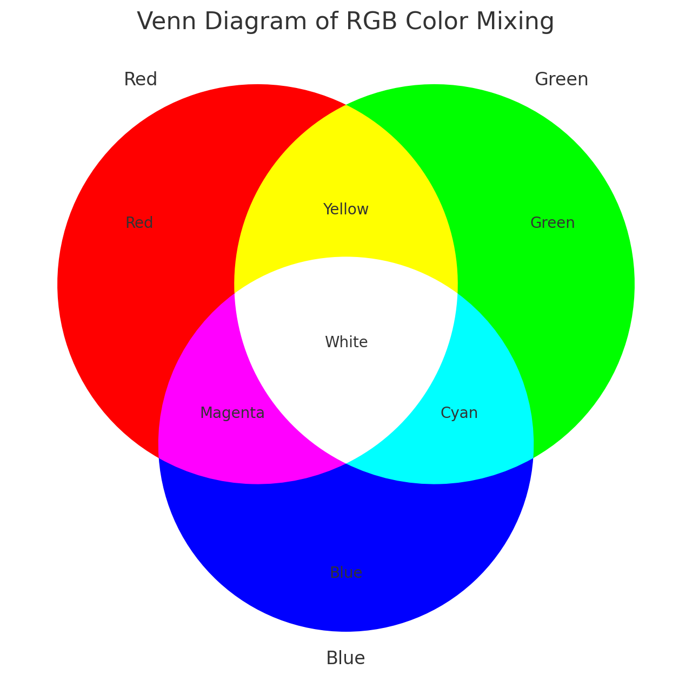
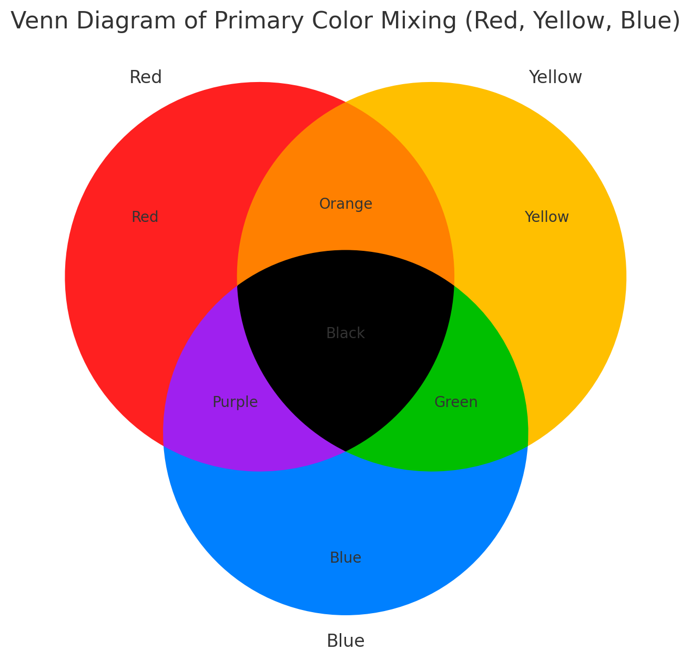

## Introduction

In our previous lesson, we created a PBMC object, completed clustering, and performed annotation. This serves as the foundation for all our subsequent analyses. In this lesson, we'll systematically explore various visualization techniques using SeuratExtend to create high-quality, publication-ready figures.

First, let's set your working directory to where we'll store all course materials. If you followed Lesson 1, this would be:

```{r, eval=FALSE}
# Set working directory to the course folder created in Lesson 1
# If you used a different location, replace this path with your chosen directory
setwd("~/Documents/single-cell-course")
```

Let's start by loading the necessary packages and our previously saved PBMC object:

```{r setup, message=FALSE, warning=FALSE}
library(Seurat)
library(SeuratExtend)

# Load the PBMC object we saved at the end of Lesson 2
pbmc <- readRDS("rds/pbmc_annotated.rds")
```

## 1. Create an Enhanced Dimensional Reduction Plot

In Seurat, dimension reduction plots such as UMAP are typically created using `DimPlot` for discrete variables and `FeaturePlot` for continuous variables. `SeuratExtend` simplifies this process with `DimPlot2`, which does not require differentiation between variable types. This function automatically recognizes the type of input parameters, whether discrete or continuous. Additionally, `DimPlot2` introduces numerous extra parameters to enrich the customization of the plots.

### Basic Usage

To generate a basic dimension reduction plot, simply call `DimPlot2` with your Seurat object:

```{r, fig.width=6.5, fig.height=5, message=FALSE, warning=FALSE}
DimPlot2(pbmc)
```

### Visualizing Different Variables

`DimPlot2` can handle both discrete and continuous variables seamlessly. Here's how to input different variables into the plot:

```{r, fig.width=9, fig.height=6, message=FALSE, warning=FALSE}
DimPlot2(pbmc, features = c("cluster", "MS4A1", "CD14", "CD3D"))
```

### Splitting by Variable

You can also split the visualization by a specific variable, which is particularly useful for comparative analysis across conditions or identities. In our current PBMC object, we only have one sample. Let's create a new column in the metadata to simulate a scenario with two samples for demonstration purposes:

```{r}
set.seed(42)  # For reproducibility
pbmc$sample <- sample(c("sample1", "sample1", "sample2"), size = ncol(pbmc), replace = TRUE)

table(pbmc$sample)  # Check the distribution
```

Now, let's create a split plot:

```{r, fig.width=7, fig.height=7, message=FALSE, warning=FALSE}
DimPlot2(pbmc, features = c("cluster", "CD14"), split.by = "sample", ncol = 1)
```

### Highlighting Specific Cells

To highlight cells of interest, such as a specific cluster, you can define the cells explicitly and use them in your plot:

```{r, fig.width=6.5, fig.height=5, message=FALSE, warning=FALSE}
b_cells <- colnames(pbmc)[pbmc$cluster == "B cell"]
DimPlot2(pbmc, cells.highlight = b_cells)
```

### Advanced Customization

For each variable, you can specify custom colors, adjust themes, and more. For detailed information on color customization, refer to the [Explore Color Functions](#explore-color-functions) section:

```{r, fig.width=9, fig.height=6, message=FALSE, warning=FALSE}
DimPlot2(
  pbmc,
  features = c("cluster", "sample", "CD14", "CD3D"),
  cols = list(
    "cluster" = "light",
    "CD14" = "D",
    "CD3D" = c("#EEEEEE", "black")
  ),
  theme = NoAxes())
```

### Adding Labels and Boxes

To further enhance the plot, you can add labels and bounding boxes to clearly delineate different groups or points of interest:

```{r, fig.width=5, fig.height=5, message=FALSE, warning=FALSE}
DimPlot2(pbmc, label = TRUE, box = TRUE, label.color = "black", repel = TRUE, theme = NoLegend())
```

### Simplifying Labels with Indices

Sometimes, cluster names are too lengthy and can make the plot appear cluttered when displayed with labels. To address this, consider using indices to replace the cluster names in the plot, which helps make the visualization cleaner. For instance, you can label clusters as 'C1', 'C2', etc., on the plot itself, while detailing what each index stands for (e.g., 'C1: B cell', 'C2: CD4 T Memory') in the figure legend:

```{r, fig.width=6.5, fig.height=5, message=FALSE, warning=FALSE}
DimPlot2(pbmc, index.title = "C", box = TRUE, label.color = "black")
```

This approach ensures that the plot remains legible and aesthetically pleasing, even when dealing with numerous or complex labels.

### Adding UMAP Arrows

Starting from v1.1.0, you can add simplified axis indicators to your dimension reduction plots using the `theme_umap_arrows` function. This is particularly useful for UMAP or t-SNE plots where traditional axes are often removed to reduce visual clutter:

```{r, fig.width=9, fig.height=6, message=FALSE, warning=FALSE}
# Add simplified axis indicators
DimPlot2(
  pbmc, 
  features = c("cluster", "sample", "CD14", "CD3D"),
  theme = NoAxes()
) + theme_umap_arrows()
```

## 2. Simultaneous Display of Three Features on a Dimension Reduction Plot

In `SeuratExtend`, a unique visualization method allows for the simultaneous display of three features on the same dimension reduction plot. The functions `FeaturePlot3` and `FeaturePlot3.grid` employ a color mixing system (either RYB or RGB) to represent three different genes (or other continuous variables). This method uses the principles of color mixing to quantitatively display the expression levels or intensities of these three features in each cell.

### RYB and RGB Color Systems

In the RGB system, black represents no or low expression, and brighter colors indicate higher levels:
{width=500px}

In the RYB system, white represents no expression, and deeper colors indicate higher expression levels:
{width=500px}

### Examples Using RYB and RGB Systems

Here's how to display three markers using the RYB system, with red for CD3D, yellow for CD14, and blue for CD79A:

```{r, fig.width=6, fig.height=5, message=FALSE, warning=FALSE}
FeaturePlot3(pbmc, color = "ryb", feature.1 = "CD3D", feature.2 = "CD14", feature.3 = "CD79A", pt.size = 0.5)
```

For the RGB system, with red for CD3D, green for CD14, and blue for CD79A:

```{r, fig.width=6, fig.height=5, message=FALSE, warning=FALSE}
FeaturePlot3(pbmc, color = "rgb", feature.1 = "CD3D", feature.2 = "CD14", feature.3 = "CD79A", pt.size = 1)
```

### Batch Visualization with `FeaturePlot3.grid`

`FeaturePlot3.grid` extends `FeaturePlot3` by allowing multiple plots to be generated in one go. The `features` parameter requires a vector where every three values are assigned a color (RYB or RGB) and placed together in one plot. If you wish to skip a color, use `NA` as a placeholder.

For instance, to place the following five genes into two plots using the RYB system, and skip yellow in the second plot:

```{r, fig.width=6.5, fig.height=3.5, message=FALSE, warning=FALSE}
FeaturePlot3.grid(pbmc, features = c("CD3D", "CD14", "CD79A", "FCGR3A", NA, "LYZ"), pt.size = 0.5)
```

### Tips on Point Size

The background is usually white, so the choice of color system and point size can significantly affect visual perception. In the RYB system, where higher expression results in darker colors, a smaller `pt.size` is preferable to prevent overlapping points. In contrast, in the RGB system, higher expressions result in lighter colors, potentially leading to visibility issues for highly expressed cells that may blend into the white background. Here, a larger `pt.size` is recommended so that the darker, low-expression points can form a "background" to highlight the lighter, high-expression points.

## 3. Visualize Cluster Distribution in Samples

### Introduction

The `ClusterDistrBar` function is designed to visualize the distribution of clusters across different samples. It can show both absolute counts and proportions, and it allows for various customizations including axis reversal and normalization.

### Basic Usage

To create a basic bar plot showing the distribution of clusters within samples, simply specify the origin (sample identifier) and cluster variables from your dataset:

```{r, fig.width=7, fig.height=3}
ClusterDistrBar(origin = pbmc$sample, cluster = pbmc$cluster)
```

### Displaying Absolute Cell Counts

If you prefer to visualize the absolute cell count rather than proportions, set the `percent` parameter to `FALSE`:

```{r, fig.width=7, fig.height=3}
ClusterDistrBar(origin = pbmc$sample, cluster = pbmc$cluster, percent = FALSE)
```

### Vertical Bar Plot

If a vertical orientation is preferred over the default horizontal bars, set the `flip` parameter to `FALSE`:

```{r, fig.width=4, fig.height=5}
ClusterDistrBar(origin = pbmc$sample, cluster = pbmc$cluster, flip = FALSE, reverse_order = TRUE)
```

### Non-Stacked Bar Plot

If you prefer not to stack the bars, which can be useful for direct comparisons of cluster sizes across samples, set the `stack` parameter to `FALSE`:

```{r, fig.width=7, fig.height=5}
ClusterDistrBar(origin = pbmc$sample, cluster = pbmc$cluster, flip = FALSE, stack = FALSE)
```

### Exporting Data Matrix

In cases where a visual plot is not required and only the underlying data matrix is needed, set the `plot` parameter to `FALSE`:

```{r}
data_matrix <- ClusterDistrBar(origin = pbmc$sample, cluster = pbmc$cluster, plot = FALSE)
# View the matrix
print(data_matrix)
```

## 4. Create an Enhanced Violin Plot

While DimPlot uses color gradients to represent expression levels, violin plots offer a more quantitative view of expression distribution. The enhanced `VlnPlot2` function in SeuratExtend integrates functionalities to superimpose boxplots, easily add statistical annotations, and offers greater flexibility in plot presentation compared to the original `VlnPlot` in Seurat.

The method to employ `VlnPlot2` will differ depending on whether you're using a Seurat object or a matrix. In this lesson, we'll focus on using a Seurat object.

### Basic Violin Plot with Box Plot and Points

Let's start by selecting the genes we want to analyze. Here's an example using three genes:

```{r, message=FALSE, warning=FALSE, fig.width=5, fig.height=6}
genes <- c("CD3D", "CD14", "CD79A")
VlnPlot2(pbmc, features = genes, ncol = 1)
```

### Hide Points and Outliers for a Cleaner Appearance

```{r, message=FALSE, warning=FALSE, fig.width=5, fig.height=6}
VlnPlot2(pbmc, features = genes, pt = FALSE, hide.outlier = TRUE, ncol = 1)
```

### Grouping by Cluster and Splitting Each Cluster by Samples

```{r, message=FALSE, warning=FALSE, fig.width=9, fig.height=7}
VlnPlot2(pbmc, features = genes, group.by = "cluster", split.by = "sample")
```

### Filtering for Certain Subtypes and Arranging Plots in Columns

```{r, message=FALSE, warning=FALSE, fig.width=6, fig.height=3}
cells <- colnames(pbmc)[pbmc$cluster %in% c("B cell", "Mono CD14", "CD8 T cell")]
VlnPlot2(pbmc, features = genes, group.by = "cluster", cells = cells)
```

### Adding Statistical Annotations Using the Wilcoxon Test

```{r, message=FALSE, warning=FALSE, fig.width=6, fig.height=3.5}
VlnPlot2(pbmc, features = genes, group.by = "cluster", cells = cells, 
         stat.method = "wilcox.test", hide.ns = TRUE)
```

### Restricting Statistical Comparisons and Using t-test

```{r, message=FALSE, warning=FALSE, fig.width=6, fig.height=4}
VlnPlot2(pbmc, features = genes, group.by = "cluster", cells = cells, 
         stat.method = "t.test", comparisons = list(c(1,2), c(1,3)), hide.ns = FALSE)
```

### Adding Mean and Median Lines

For genes with low expression where boxplot might be hard to interpret (e.g., when median and quartiles overlap at zero), you can add mean/median lines for better visualization:

```{r, message=FALSE, warning=FALSE, fig.width=6, fig.height=6.5}
lowExprGenes <- c("CCR7", "IL7R", "TCF7")
VlnPlot2(pbmc, 
         features = lowExprGenes, 
         show.mean = TRUE,      # Show mean and median lines
         mean_colors = c("red", "blue"),  # Colors for mean and median
         cols = "light",        # Light color scheme for better visibility
         ncol = 1)
```

## 5. Generate a Heatmap Plot

### Introduction

The `Heatmap` function provides a flexible and comprehensive way to visualize matrices, especially those produced by the `CalcStats` function.

### Basic Usage

First, let's generate a sample matrix using the `CalcStats` function:

```{r, message=FALSE, warning=FALSE}
# Assuming pbmc data and VariableFeatures function are available
genes <- VariableFeatures(pbmc)
toplot <- CalcStats(pbmc, features = genes, method = "zscore", order = "p", n = 4)
head(toplot, 10)
```

Now, we can produce a basic heatmap:

```{r, message=FALSE, warning=FALSE, fig.width=5, fig.height=6.5}
Heatmap(toplot, lab_fill = "zscore")
```

Note that this provides a convenient method to display marker genes (or differentially expressed genes, DEGs) for each cluster, which is very practical. However, this is not the only method. Let's also learn about Seurat's built-in method for finding DEGs.

```{r, message=FALSE, warning=FALSE}
# Find all markers of B cells
bcell.markers <- FindMarkers(pbmc, ident.1 = "B cell", logfc.threshold = 1, only.pos = TRUE)
head(bcell.markers)
```

This compares all B cells to non-B cells to find DEGs. If you want to compare B cells with specific clusters, you can set the `ident.2` parameter.

We can also use `FindAllMarkers` to conveniently generate marker genes for all clusters:

```{r}
pbmc.markers <- FindAllMarkers(pbmc, logfc.threshold = 2, only.pos = TRUE)
head(pbmc.markers, 10)
```

### Customizing the Heatmap

#### Modifying Axis and Labels

Sometimes, the first name on the x-axis might be too long and exceed the left boundary of the plot. To prevent this issue and ensure all labels are fully visible, you can increase the space on the left side of the plot by adjusting the `plot.margin` parameter:

```{r, fig.width=5, fig.height=7, message=FALSE, warning=FALSE}
Heatmap(toplot, lab_fill = "zscore", plot.margin = margin(l = 30))
```

For denser matrices, you may wish to only show a subset of gene names:

```{r, fig.width=5, fig.height=7, message=FALSE, warning=FALSE}
genes <- VariableFeatures(pbmc)[1:500]
toplot2 <- CalcStats(pbmc, features = genes, method = "zscore", order = "p")
Heatmap(toplot2, lab_fill = "zscore", feature_text_subset = genes[1:20], expand_limits_x = c(-0.5, 12))
```

#### Faceting the Heatmap

You can also split the heatmap based on gene groups:

```{r, fig.width=5, fig.height=7, message=FALSE, warning=FALSE}
gene_groups <- sample(c("group1", "group2", "group3"), nrow(toplot2), replace = TRUE)
Heatmap(toplot2, lab_fill = "zscore", facet_row = gene_groups) +
  theme(axis.text.y = element_blank())
```

## 6. Create Enhanced Dot Plots

### Introduction

While heatmaps are excellent for visualizing overall patterns, dot plots offer a complementary visualization that combines two key pieces of information:
1. The percentage of cells expressing each feature (represented by dot size)
2. The average expression level in expressing cells (represented by color intensity)

This dual representation can provide more detailed insights than a standard heatmap, particularly when expression patterns vary between cell populations.

### Basic Usage

Let's create a basic dot plot for some variable features:

```{r, message=FALSE, warning=FALSE, fig.width=6, fig.height=4.5}
# Select some variable features
genes <- VariableFeatures(pbmc)[1:10]
DotPlot2(pbmc, features = genes)
```

### Grouped Features

You can organize features into groups for clearer visualization:

```{r, message=FALSE, warning=FALSE, fig.width=6.5, fig.height=5}
# Create grouped features
grouped_features <- list(
  "B_cell_markers" = c("MS4A1", "CD79A"),
  "T_cell_markers" = c("CD3D", "CD8A", "IL7R"),
  "Myeloid_markers" = c("CD14", "FCGR3A", "S100A8")
)

DotPlot2(pbmc, features = grouped_features)
```

### Split Visualization

You can split the visualization by a metadata column to compare expression patterns across different conditions:

```{r, message=FALSE, warning=FALSE, fig.width=8, fig.height=5.5}
# Basic split visualization
DotPlot2(pbmc, features = genes, group.by = "cluster", split.by = "orig.ident", show_grid = FALSE)
```

### Alternative Split Visualization

The split groups can be represented either by border colors (default) or by dot colors:

```{r, message=FALSE, warning=FALSE, fig.width=8, fig.height=5}
# Using colors instead of borders for split groups
DotPlot2(pbmc, 
         features = genes, 
         group.by = "cluster", 
         split.by = "orig.ident", 
         split.by.method = "color", 
         show_grid = FALSE)
```

### Customizing Appearance

You can customize various aspects of the plot, including color schemes, dot sizes, and grid lines:

```{r, message=FALSE, warning=FALSE, fig.width=7, fig.height=5}
DotPlot2(pbmc, 
         features = grouped_features, 
         color_scheme = "BuRd", 
         border = FALSE,        # Remove dot borders
         show_grid = FALSE,     # Remove grid lines
         flip = TRUE)          # Flip coordinates
```

## 7. Generate a Waterfall Plot

### Introduction

Waterfall plots are powerful visualization tools that can display differences between two conditions, showing gene expression, gene set enrichment, or other metrics. This function can handle inputs directly from Seurat objects or pre-processed matrices.

You can use the waterfall plot to compare expression levels of genes directly from a Seurat object, using LogFC to determine the bar length. Here's how to do it for the top 80 variable features:

```{r, fig.width=10, fig.height=4, message=FALSE, warning=FALSE}
genes <- VariableFeatures(pbmc)[1:80]
WaterfallPlot(
  pbmc, group.by = "cluster", features = genes,
  ident.1 = "Mono CD14", ident.2 = "CD8 T cell", length = "logFC")
```

### Focusing on Extremes

To further hone in on the most differentially expressed genes, you might want to keep only the top and bottom 20 genes. This can highlight the most critical differences between the two cell types:

```{r, fig.width=7, fig.height=4, message=FALSE, warning=FALSE}
WaterfallPlot(
  pbmc, group.by = "cluster", features = genes,
  ident.1 = "Mono CD14", ident.2 = "CD8 T cell", length = "logFC",
  top.n = 20)
```

Additionally, you can set parameters to modify the plot, such as filtering features based on a specific threshold, rotating the plot 90 degrees (by setting `flip`), and more. For detailed options, refer to the function's help documentation.

## 8. Create Volcano Plots

### Introduction

The Volcano plot is a specialized variation of the scatter plot that combines statistical significance (-log10 p-value) with magnitude of change (typically log fold change). While Waterfall plots focus on ordered visualization of differences, Volcano plots provide a comprehensive view of both the magnitude and statistical significance of changes.

### Basic Usage

Create a basic volcano plot comparing two cell types:

```{r, message=FALSE, warning=FALSE, fig.width=5, fig.height=5}
VolcanoPlot(pbmc, 
            ident.1 = "B cell",
            ident.2 = "CD8 T cell")
```

### Customizing Thresholds

You can set custom thresholds for both axes:

```{r, message=FALSE, warning=FALSE, fig.width=5, fig.height=5}
VolcanoPlot(
  pbmc,
  ident.1 = "B cell",
  ident.2 = "CD8 T cell",
  x.threshold = 0.5,    # Log fold change threshold
  y.threshold = 2     # -log10(p-value) threshold
)
```

## 9. Tips: Choosing the Right Visualization

When visualizing gene expression or pathway activity data, different plot types serve different purposes. Here's a guide to help you choose:

1. Overview Visualizations:
   - **Heatmaps**:
     * Best for: Comparing many features across multiple groups using color intensity
     * Advantage: Compact visualization of large-scale patterns
     * Limitation: Color intensity alone may not show detailed expression patterns
   - **Dot Plots**:
     * Best for: Similar to heatmaps but with additional information
     * Advantage: Shows both expression level (color) and percent expressing cells (size)
     * Limitation: Takes more space than heatmaps

2. Two-Group Comparisons:
   - **Waterfall Plots**:
     * Best for: Ordered visualization of differences between two groups
     * Advantage: Clear ranking of most differential features
     * Limitation: Limited to two-group comparisons
   - **Volcano Plots**:
     * Best for: Combining fold change with statistical significance
     * Advantage: Shows both effect size and significance
     * Limitation: Also limited to two-group comparisons

3. Detailed Expression Analysis:
   - **Violin Plots**:
     * Best for: Detailed view of expression distribution
     * Advantage: Shows full distribution shape and statistical comparisons
     * Limitation: Space-intensive, limiting the number of features that can be shown

## 10. Explore Color Functions

The `SeuratExtend` package provides comprehensive color management across all visualization functions. Each function type handles colors slightly differently depending on whether it's dealing with discrete or continuous variables.

For more detailed information, refer to the online tutorial: https://huayc09.github.io/SeuratExtend/articles/Visualization.html#explore-color-functions 

### Recommended Color Schemes

Here are some recommended color schemes for different visualization needs in single-cell analysis:

#### For Discrete Variables (e.g., clusters, conditions)

The "light" color scheme from SeuratExtend's `color_pro` is particularly effective for labeled visualizations:

```{r, fig.width=7.5, fig.height=4, message=FALSE, warning=FALSE}
library(cowplot)
plot_grid(
  DimPlot2(pbmc, cols = "light", theme = NoAxes() + NoLegend()),
  ClusterDistrBar(pbmc$orig.ident, pbmc$cluster, cols = "light", flip = FALSE, border = "black") +
    theme(axis.title.x = element_blank())
)
```

#### For Continuous Variables (e.g., gene expression)

the "A" or "D" color schemes from viridis:

```{r, message=FALSE, warning=FALSE, fig.width=5, fig.height=6.5}
Heatmap(toplot, lab_fill = "zscore", color_scheme = "A")
```

```{r, fig.width=7, fig.height=4}
WaterfallPlot(
  pbmc, group.by = "cluster", features = VariableFeatures(pbmc)[1:80],
  ident.1 = "Mono CD14", ident.2 = "CD8 T cell", length = "logFC",
  top.n = 20, color_theme = "D")
```

You can also use various color palettes from RColorBrewer (https://r-graph-gallery.com/38-rcolorbrewers-palettes.html):

```{r, fig.width=8, fig.height=7, message=FALSE, warning=FALSE}
library(RColorBrewer)
markers_genes <- c(
  "MS4A1", "GNLY", "CD3E",
  "CD8A", "CCR7", "CD14",
  "FCER1A", "FCGR3A", "PPBP")
DimPlot2(
  pbmc,
  features = markers_genes,
  cols = "OrRd",
  theme = NoAxes())
```

```{r, fig.width=8, fig.height=7, message=FALSE, warning=FALSE}
DimPlot2(
  pbmc,
  features = markers_genes,
  cols = "Spectral-rev",
  theme = NoAxes())
```

## 11. Mastering ggplot2 for Custom Visualizations

### Introduction to ggplot2

While `SeuratExtend` provides many convenient functions for visualization, all of these are built on top of `ggplot2.` Understanding `ggplot2` can give you more flexibility in customizing your plots and creating entirely new visualizations. In this section, we'll cover the basics of `ggplot2` and how to use it with Seurat data.

### The Grammar of Graphics

ggplot2 is based on the Grammar of Graphics, a layered approach to creating visualizations. The basic components are:

1. Data: The dataset you want to visualize
2. Aesthetics: How your data maps to visual properties (position, color, size, etc.)
3. Geometries: The actual shapes used to represent your data (points, lines, bars, etc.)
4. Facets: Optional subdivision of the plot into multiple plots
5. Statistics: Optional statistical transformations of the data
6. Coordinates: The space on which the data will be plotted
7. Themes: All non-data ink

### Creating a Basic Plot from Seurat Data

Let's start by creating the most basic UMAP plot using ggplot2:

```{r, fig.width=6, fig.height=5}
# Extract data from the Seurat object
umap_data <- FetchData(pbmc, vars = c("umap_1", "umap_2", "cluster", "CD3D", "sample"))
head(umap_data)

# Create the most basic plot
ggplot(umap_data, aes(x = umap_1, y = umap_2, color = CD3D)) +
  geom_point()
```

This is the most basic plot we can create. It shows the UMAP coordinates of our cells, colored by CD3D expression. However, it's not very visually appealing or informative in its current state. Let's improve it step by step:

```{r, fig.width=6, fig.height=5}
# Create an improved plot
library(viridis)
ggplot(umap_data, aes(x = umap_1, y = umap_2, color = CD3D)) +
  geom_point(size = 0.5, alpha = 0.7) +
  scale_color_viridis() +
  theme_minimal() +
  labs(title = "UMAP colored by CD3D expression",
       x = "UMAP_1", y = "UMAP_2")
```

Let's break down the improvements we made:

1. We adjusted the size and transparency of the points using `size = 0.5, alpha = 0.7` in `geom_point()`. This helps to visualize dense areas better.
2. We used `scale_color_viridis()` to apply a colorblind-friendly, perceptually uniform color scale.
3. We applied `theme_minimal()` to remove unnecessary plot elements and give it a cleaner look.
4. We added a title and axis labels using `labs()`.

These small changes significantly improve the readability and aesthetics of our plot. In the following sections, we'll explore even more ways to customize and enhance our visualizations.

### Customizing the Plot

Now let's customize our plot further:

```{r, fig.width=7, fig.height=4}
ggplot(umap_data, aes(x = umap_1, y = umap_2, color = CD3D)) +
  geom_point(size = 0.5, alpha = 0.7) +
  scale_color_viridis(option = "A") +
  facet_wrap(~sample, ncol = 3) +
  theme_bw() +
  theme(axis.text = element_blank(),
        axis.ticks = element_blank(),
        panel.grid = element_blank(),
        strip.background = element_rect(fill = "white"),
        strip.text = element_text(face = "bold")) +
  labs(title = "UMAP by cluster, colored by CD3D expression",
       x = "UMAP_1", y = "UMAP_2")
```

In this version:

1. We've used `facet_wrap()` to create separate plots for each cluster.
2. We've customized the theme further using `theme()` to remove axis text, ticks, and grid lines.
3. We've styled the facet labels with a white background and bold text.

### Combining Multiple Plots

Often, we want to combine multiple plots into a single figure. The `cowplot` package is great for this:

```{r, fig.width=8, fig.height=4.5}
library(cowplot)

# Create two plots
plot1 <- ggplot(umap_data, aes(x = umap_1, y = umap_2, color = cluster)) +
  geom_point(size = 0.5, alpha = 0.7) +
  scale_color_manual(values = color_pro(9,2)) +
  theme_minimal() +
  theme(legend.position = "none") +
  labs(title = "Clusters")

plot2 <- ggplot(umap_data, aes(x = umap_1, y = umap_2, color = CD3D)) +
  geom_point(size = 0.5, alpha = 0.7) +
  scale_color_viridis_c(option = "A") +
  theme_minimal() +
  labs(title = "CD3D Expression")

# Combine plots
combined_plot <- plot_grid(plot1, plot2, labels = c("A", "B"), ncol = 2)

# Add a title to the combined plot
title <- ggdraw() + 
  draw_label("UMAP Visualization of PBMC Data", fontface = "bold", x = 0, hjust = 0) +
  theme(plot.margin = margin(0, 0, 0, 7))

plot_grid(title, combined_plot, ncol = 1, rel_heights = c(0.1, 1))
```

### Saving Your Plots

Finally, let's save our plot using `ggsave()`:

```{r}
dir.create("results", showWarnings = FALSE)
ggsave("results/pbmc_umap_plot.png", combined_plot, width = 8, height = 4.5, dpi = 300)
```

This will save the plot as a high-resolution PNG file.

### Tips for Further Customization

Remember, while ggplot2 offers extensive customization options, it can sometimes be complex. Don't hesitate to consult the ggplot2 documentation, online resources, or AI assistants like Claude or ChatGPT for help with specific customizations.

This concludes our lesson on advanced visualization techniques. You now have a solid foundation in creating and customizing plots for your single-cell RNA-seq data analysis. In the next lesson, we'll explore more advanced analytical techniques to further your understanding of single-cell data.
