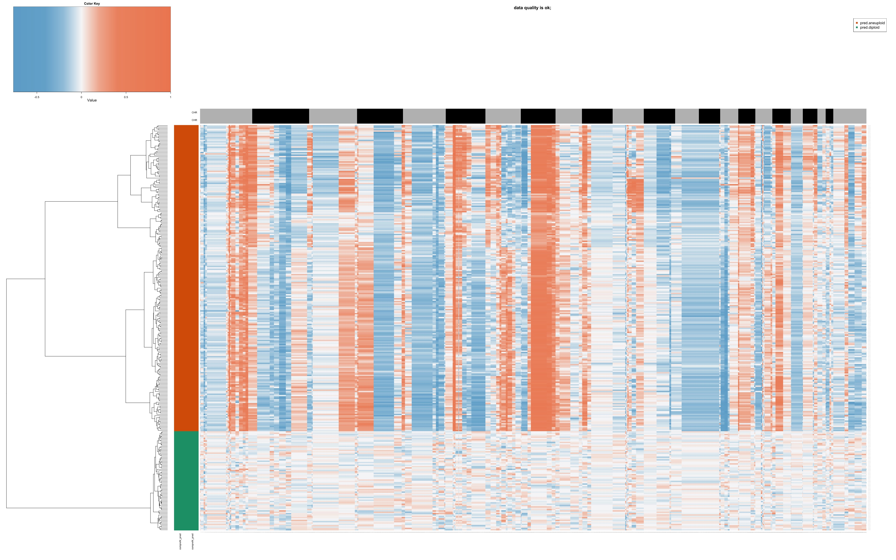

## 4. Label Transfer with singleCellNet

### Introduction to Label Transfer

Label transfer is a crucial technique in single-cell RNA sequencing analysis. It allows us to use information from well-annotated datasets (reference data) to classify cells in new, unannotated datasets (query data). This is particularly useful when working with novel or poorly characterized cell populations.

### singleCellNet: A Tool for Label Transfer

[singleCellNet](https://github.com/pcahan1/singleCellNet) is a machine learning-based tool designed for classifying cells in single-cell RNA sequencing data. It offers robust performance across different platforms and species and provides interpretable feature importance scores.

### Setting Up singleCellNet

First, let's install and load the necessary libraries:

```{r, message=FALSE, warning=FALSE}
if (!requireNamespace("devtools", quietly = TRUE)) install.packages("devtools")
if (!requireNamespace("singleCellNet", quietly = TRUE)) devtools::install_github("pcahan1/singleCellNet")

library(Seurat)
library(SeuratExtend)
library(singleCellNet)
library(SingleCellExperiment)
```

### Preparing the Data

For this example, we'll use two datasets: one as a reference (training) set and another as a query (test) set. Let's assume we have these as Seurat objects:

```{r data_prep}
# Load your reference and query Seurat objects
# In a real scenario, you would load your data here
reference_seurat <- pbmc
query_seurat <- readRDS("rds/pbmc_merge.rds")

# Convert Seurat objects to SingleCellExperiment objects
sce_reference <- as.SingleCellExperiment(reference_seurat)
sce_query <- as.SingleCellExperiment(query_seurat)

# Find common genes between the two datasets
commonGenes <- intersect(rownames(sce_reference), rownames(sce_query))

# Subset both datasets to only include common genes
sce_reference <- sce_reference[commonGenes, ]
sce_query <- sce_query[commonGenes, ]
```

### Training the Classifier

Now, let's train the singleCellNet classifier using our reference dataset:

```{r train_classifier}
# Prepare training data
stTrain <- data.frame(
  cell_name = rownames(colData(sce_reference)), 
  cell_type = colData(sce_reference)$cluster
)

expTrain <- assays(sce_reference)$counts

# Train the classifier
class_info <- scn_train(
  stTrain = stTrain, 
  expTrain = expTrain, 
  nTopGenes = 10, 
  nRand = 70, 
  nTrees = 1000, 
  nTopGenePairs = 25, 
  dLevel = "cell_type", 
  colName_samp = "cell_name"
)
```

### Classifying Cells in the Query Dataset

With our trained classifier, we can now classify cells in our query dataset:

```{r classify_query}
classRes_query <- scn_predict(
  cnProc = class_info[['cnProc']], 
  expDat = assays(sce_query)$counts, 
  nrand = 50
)

# Add classification results to the query Seurat object
query_seurat$Predicted_Labels <- rownames(classRes_query)[apply(classRes_query[,colnames(query_seurat)], 2, which.max)]
```

### Visualizing the Results

Let's visualize the classification results:

```{r visualize_results, fig.width=7.5, fig.height=6}
# Create a UMAP plot colored by the singleCellNet classifications
DimPlot2(query_seurat, group.by = "Predicted_Labels", label = TRUE)
```

### Interpreting the Results

This plot shows how cells in our query dataset have been classified based on the reference dataset. Each color represents a different cell type predicted by singleCellNet.

Key points to consider when interpreting these results:
1. Clusters of cells with the same classification suggest consistent cell types.
2. Cells classified as multiple types or with low confidence scores may represent novel cell types or states not present in the reference data.
3. The accuracy of classification depends on the quality and relevance of the reference dataset.

### Conclusion

singleCellNet provides a powerful method for transferring cell type labels from a reference dataset to a new query dataset. This can greatly aid in the annotation of novel single-cell RNA sequencing data, especially when dealing with complex or poorly characterized tissues.

However, it's important to remember that computational predictions should always be validated with biological knowledge and, when possible, experimental validation.

## 5. MAGIC for Denoising and Smoothing Gene Expression

[MAGIC (Markov Affinity-based Graph Imputation of Cells)](https://github.com/KrishnaswamyLab/MAGIC) is another powerful tool in the single-cell RNA sequencing analysis toolkit. It's designed to address one of the major challenges in scRNA-seq data: the high levels of noise and data sparsity due to technical limitations in the sequencing process.

### What is MAGIC and Why Do We Need It?

Single-cell RNA sequencing data often suffers from:

1. Dropout events: Where genes are not detected even though they are actually expressed.
2. Technical noise: Random fluctuations in gene expression measurements.

These issues can make it difficult to identify true biological signals and patterns in the data. MAGIC helps to address these problems by:

- Denoising the data: Reducing random technical noise.
- Imputing missing values: Filling in likely gene expression values for dropout events.
- Smoothing gene expression: Creating a more continuous representation of gene expression across cells.

MAGIC works by constructing a graph representing the similarity between cells, and then using this graph to share information between similar cells. This process helps to recover gene-gene relationships and reveal cellular trajectories that might be obscured in the raw data.

### Running MAGIC with SeuratExtend

The `SeuratExtend` package makes it easy to run MAGIC on your Seurat object. Here's how you can do it:

```{r run-magic, message=FALSE, warning=FALSE}
mye_small <- readRDS(url("https://zenodo.org/records/10944066/files/pbmc10k_mye_small_velocyto.rds", "rb"))
mye_small <- Palantir.Magic(mye_small)

# MAGIC creates a new assay called "magic" in the Seurat object
# Let's normalize this new assay
mye_small <- NormalizeData(mye_small)
```

### Visualizing the Effects of MAGIC

To see the impact of MAGIC, we can compare the original gene expression with the MAGIC-imputed expression:

```{r visualize-magic, fig.width=8, fig.height=6}
# Compare original and MAGIC-imputed expression for CD14 and FLT3
DimPlot2(mye_small, features = c("CD14", "magic_CD14", "FLT3", "magic_FLT3"), 
         theme = NoAxes(), cols = "A")
```

In these plots:
- "CD14" and "FLT3" show the original gene expression.
- "magic_CD14" and "magic_FLT3" show the MAGIC-imputed expression.

You should notice that the MAGIC-imputed plots appear smoother and have fewer cells with zero expression. This is because MAGIC has filled in likely expression values for dropout events and smoothed the overall expression pattern.

### Interpreting MAGIC Results

When interpreting MAGIC results, keep in mind:

1. Smoothed data can reveal patterns that were obscured in the original data.
2. However, MAGIC may also remove some of the biological noise that could be important in certain analyses.
3. MAGIC-imputed data is great for visualization and exploratory analysis, but you should use the original data for statistical tests and differential expression analysis.

### Using MAGIC in Your Analysis Workflow

MAGIC can be particularly useful for:

- Visualizing gene expression patterns, especially for genes with low expression.
- Exploring gene-gene relationships.
- Enhancing trajectory inference analyses.

However, always compare MAGIC results with your original data to ensure you're not over-interpreting imputed patterns.

## 6. Copy Number Variation Analysis: CopyKat

[CopyKat](https://github.com/navinlabcode/copykat) (Copynumber Karyotyping of Tumors) is a computational tool designed to infer genomic copy number and subclonal structure of human tumors from single-cell RNA sequencing data. It's particularly useful in cancer research for identifying aneuploid cells and understanding tumor heterogeneity.

### What is CopyKat and Why is it Important?

CopyKat addresses several key challenges in single-cell RNA sequencing of human tumors:

1. Distinguishing cancer cells from stromal cell types
2. Identifying the presence of multiple tumor subclones
3. Inferring genome-wide aneuploidy at 5MB resolution in single cells

The tool is based on the principle that gene expression levels of many adjacent genes can be influenced by genomic DNA copy numbers in that region. CopyKat's estimated copy numbers can achieve a high concordance (80%) with actual DNA copy numbers obtained by whole genome DNA sequencing.

### Installing CopyKat

You can install CopyKat from GitHub using the following R code:

```{r, eval=FALSE}
if (!require("copykat")) remotes::install_github("navinlabcode/copykat")
```

### Running CopyKat

To run CopyKat, you need a raw gene expression matrix, with gene IDs in rows and cell names in columns. The matrix values are typically the count of unique molecular identifiers (UMI) from high-throughput single-cell RNA-seq data.

Here's a basic example of running CopyKat:

```{r, eval=FALSE}
library(copykat)

# Assuming 'exp.rawdata' is your raw UMI count matrix
copykat.test <- copykat(
  rawmat=exp.rawdata, 
  id.type="S", 
  cell.line="no", 
  ngene.chr=5, 
  win.size=25, 
  KS.cut=0.1, 
  sam.name="test", 
  distance="euclidean", 
  n.cores=1)
```

### Interpreting CopyKat Results

CopyKat provides several outputs:

1. Prediction of aneuploid (tumor) and diploid (normal) cells
2. A copy number matrix for each cell
3. A heatmap visualization of copy number variations

Here's an example of what the prediction results might look like:

```{r, eval=FALSE}
head(copykat.test$prediction)
```

And here's how you might access the copy number matrix:

```{r, eval=FALSE}
head(copykat.test$CNAmat[, 1:5])
```

### Visualizing CopyKat Results

CopyKat generates a heatmap of estimated copy numbers. Here's an example of what this heatmap might look like:



In this heatmap:
- Rows represent single cells
- Columns represent 220kb bins in genomic order
- Colors indicate copy number state (red for amplifications, blue for deletions)

### Subpopulation Analysis

After identifying aneuploid cells, CopyKat can be used to define subpopulations of tumor cells based on their copy number profiles. This can provide insights into tumor heterogeneity and evolution.

### Conclusion

CopyKat is a powerful tool for analyzing copy number variations in single-cell RNA sequencing data. It can help researchers distinguish tumor cells from normal cells, identify subclones within tumors, and gain insights into tumor heterogeneity. However, as with all computational predictions, it's important to validate key findings with orthogonal methods when possible.

## 7. TCR/BCR Analysis: scRepertoire

[scRepertoire](https://github.com/ncborcherding/scRepertoire) is a toolkit designed for single-cell immune profiling analysis, specifically focusing on T-cell receptor (TCR) and B-cell receptor (BCR) data. It provides a suite of functions to analyze and visualize immune repertoire data in conjunction with single-cell RNA sequencing data.

### Understanding TCR and BCR

T-cell receptors (TCRs) and B-cell receptors (BCRs) are crucial components of the adaptive immune system:

1. TCRs are found on T cells and recognize peptide antigens presented by MHC molecules.
2. BCRs are found on B cells and can recognize a wide variety of antigens directly.

These receptors are highly diverse due to a process called V(D)J recombination, which allows for the generation of millions of unique receptors. This diversity is key to the immune system's ability to recognize a vast array of potential pathogens.

### Why is TCR/BCR Analysis Important?

Analyzing TCR and BCR repertoires can provide insights into:

1. The specificity and diversity of immune responses
2. Clonal expansion in response to antigens
3. Potential targets for immunotherapy
4. The development of the immune repertoire over time or in different conditions

### Introduction to scRepertoire

**scRepertoire** is an R package that allows for easy integration of single-cell RNA sequencing data with TCR/BCR repertoire data. It supports various single-cell clonal formats including 10x Genomics, AIRR, BD, MiXCR, Omniscope, TRUST4, and WAT3R.

Key features of scRepertoire include:

1. Loading and combining TCR/BCR data from various sources
2. Analyzing clonotype frequencies and distributions
3. Visualizing repertoire diversity
4. Integration with popular single-cell analysis frameworks like Seurat

### Getting Started with scRepertoire

To install scRepertoire, you can use the following commands:

```{r, eval=FALSE}
BiocManager::install("scRepertoire")
```

### Reading CellRanger Output

scRepertoire can directly read the output from 10x Genomics Cell Ranger pipeline. The main file it uses is the `filtered_contig_annotations.csv`, which is typically located in the `./outs/` directory of the VDJ alignment folder.

Here's how you might load this data:

```{r, eval=FALSE}
library(scRepertoire)

# Read the filtered_contig_annotations.csv files
S1 <- read.csv("path/to/Sample1/outs/filtered_contig_annotations.csv")
S2 <- read.csv("path/to/Sample2/outs/filtered_contig_annotations.csv")

# Create a list of the contig data
contig_list <- list(S1, S2)

# Process the contig data
combined <- combineTCR(contig_list, samples = c("sample1", "sample2"))
```

This `combined` object now contains detailed information about the TCR/BCR sequences, including:

- Clonotype frequencies
- V, D, and J gene usage
- CDR3 sequences
- Chain pairing information

### Further Resources

scRepertoire offers a wide range of functions for in-depth analysis of TCR/BCR data. For detailed tutorials and function information, users are encouraged to visit the [comprehensive documentation website](https://www.borch.dev/uploads/screpertoire/).

## Conclusion

This concludes our comprehensive journey through advanced single-cell RNA sequencing analysis techniques. We've explored a wide range of sophisticated methods, from regulatory network inference with SCENIC to trajectory analysis with scVelo and Palantir, cell-cell communication analysis with CellChat and NicheNet, label transfer with singleCellNet, data imputation with MAGIC, copy number variation analysis with CopyKat, and TCR/BCR analysis with scRepertoire.

These advanced techniques provide powerful tools to extract deeper biological insights from your single-cell data. However, it's important to remember that each of these methods comes with its own assumptions and limitations. Always interpret results in the context of your biological system and research questions, and when possible, validate key findings with orthogonal experimental approaches.

As the field of single-cell genomics continues to evolve rapidly, new tools and methods are constantly being developed. We encourage you to stay curious, keep learning, and explore the latest developments in this exciting field. Your journey in single-cell analysis is just beginning, and we hope this course has provided you with a solid foundation to tackle complex biological questions using these cutting-edge techniques.

Remember, the key to successful analysis often lies in combining multiple approaches and integrating different types of data. Don't hesitate to revisit earlier lessons as you apply these advanced techniques to your own research projects. Good luck with your future single-cell analyses!
