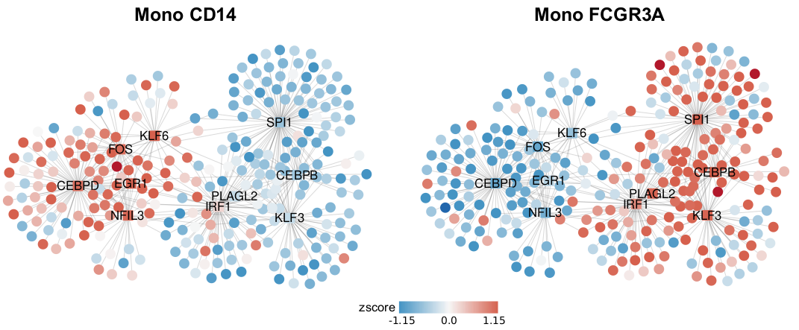
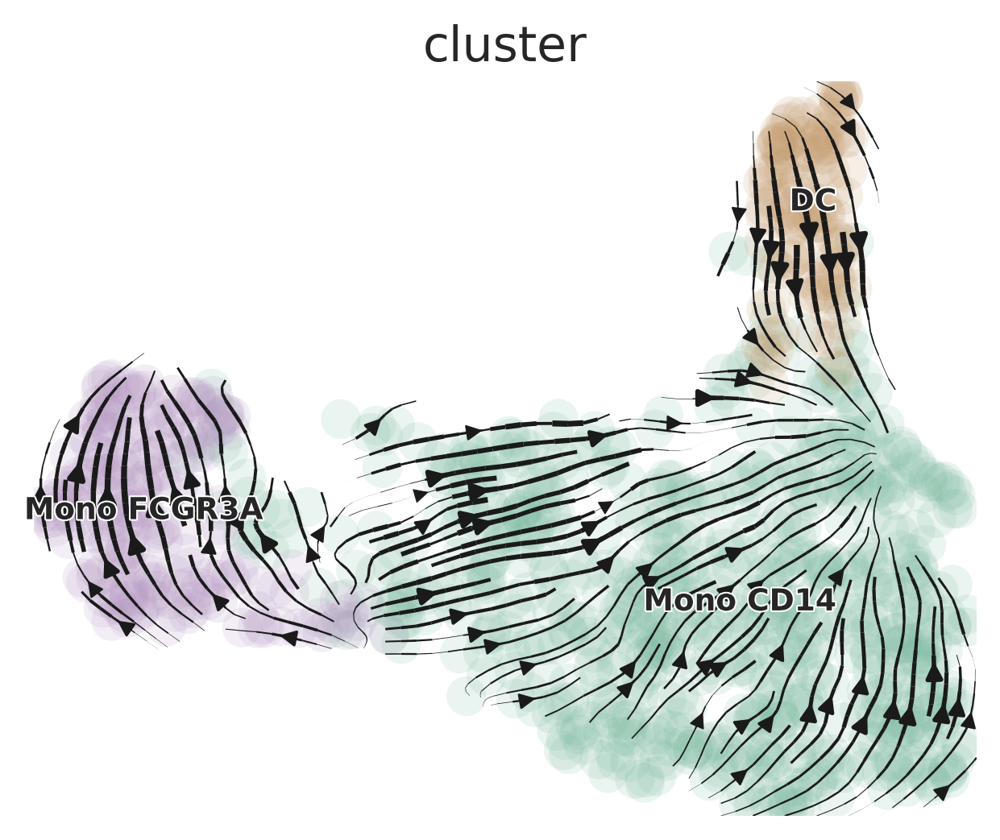
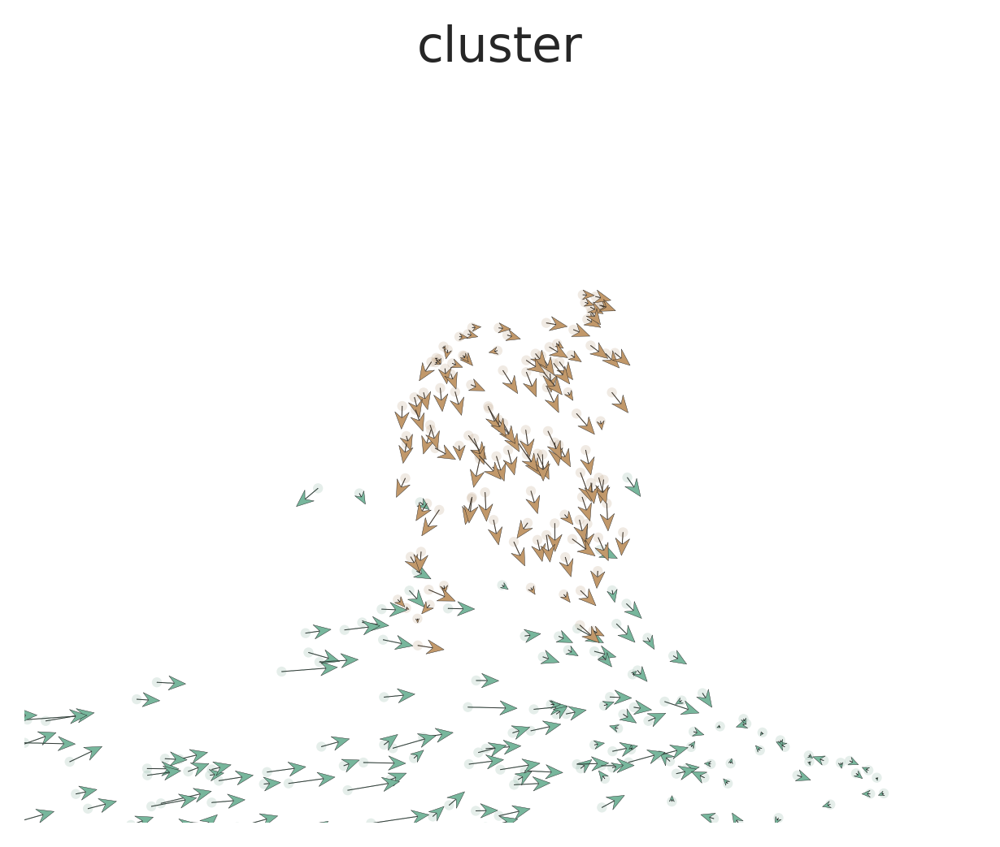

## Introduction

In this lesson, we'll explore advanced analytical methods for single-cell RNA sequencing data. These techniques provide deeper insights into cellular processes, regulatory networks, and cell-cell interactions. While some of these operations may be time-consuming and might not be performed in real-time during the class, we provide tutorials and explanations for each method to facilitate your independent exploration after the course.

This lesson will cover the following topics:

1. Gene Regulatory Network Analysis: SCENIC
2. Trajectory Analysis: scVelo and Palantir
3. Label Transfer: singleCellNet
4. Cell-Cell Communication: CellChat and NicheNet
5. Data Imputation: MAGIC 
6. Copy Number Variation Analysis: CopyKat
7. TCR/BCR Analysis: scRepertoire

First, let's set your working directory to where we'll store all course materials. If you followed Lesson 1, this would be:

```{r, eval=FALSE}
# Set working directory to the course folder created in Lesson 1
# If you used a different location, replace this path with your chosen directory
setwd("~/Documents/single-cell-course")
```

## 1. SCENIC: Single-Cell Regulatory Network Inference and Clustering

SCENIC (Single-Cell Regulatory Network Inference and Clustering) is a powerful computational method that provides insights into the regulatory networks governing gene expression in single cells. It identifies transcription factors (TFs), their target genes, and their activity in individual cells.

### Background

SCENIC was introduced in a [Nature Methods paper](https://www.nature.com/articles/nmeth.4463) and has become a valuable tool in single-cell analysis. The method consists of three main steps:

1. Identification of co-expression modules using GENIE3 or GRNBoost
2. Refinement of these modules based on enrichment of TF binding motifs (RcisTarget)
3. Evaluation of the activity of each module in each cell (AUCell)

For optimal performance, it's recommended to use the Nextflow pipeline to run SCENIC, which can be found [here](https://github.com/aertslab/SCENICprotocol/).

### Importing SCENIC Results into Seurat

While `SeuratExtend` doesn't currently include a `RunScenic` function, it does provide tools to import and analyze SCENIC results within the Seurat framework. Let's start by importing a pre-computed SCENIC loom file:

```{r, message=FALSE, warning=FALSE}
library(Seurat)
library(SeuratExtend)
```

```{r, message=FALSE, warning=FALSE}
# Download the pre-computed SCENIC loom file
scenic_loom_path <- file.path(tempdir(), "pyscenic_integrated-output.loom")
download.file("https://zenodo.org/records/10944066/files/pbmc3k_small_pyscenic_integrated-output.loom",
              scenic_loom_path, mode = "wb")  # Use binary mode for Windows compatibility

# Use the example PBMC dataset from SeuratExtend package
pbmc <- SeuratExtend::pbmc

# Import SCENIC results into our Seurat object
pbmc <- ImportPyscenicLoom(scenic_loom_path, seu = pbmc)
```

### Examining SCENIC Outputs

SCENIC results are stored in `seu@misc$SCENIC`. Let's take a look at some of the key components:

```{r}
# View the AUCell matrix (TF activity scores)
tf_auc <- pbmc@misc$SCENIC$RegulonsAUC
head(tf_auc[, 1:5])
```

The AUCell scores represent the enrichment of target genes for each TF in each cell, indicating regulon activity.

```{r}
# View the list of TFs and their target genes
tf_gene_list <- pbmc@misc$SCENIC$Regulons
str(tf_gene_list, list.len = 10, max.level = 1)
```

### Visualizing SCENIC Results

Now that we have integrated SCENIC data into our Seurat object, we can use various visualization tools to explore these regulatory networks.

#### Identifying Top Activated TFs in Each Cluster

Let's create a heatmap to visualize the top activated TFs in each cluster:

```{r, fig.width=6, fig.height=8, message=FALSE, warning=FALSE}
tf_zscore <- CalcStats(tf_auc, f = pbmc$cluster, order = "p", n = 4, t = TRUE)
Heatmap(tf_zscore, lab_fill = "zscore")
```

This heatmap shows the relative activity (z-score) of top TFs across different cell clusters. Darker colors indicate higher activity.

#### Comparing TF Gene Expression Levels and Regulon Activity

We can compare the expression levels of TFs with their regulon activity:

```{r, fig.width=8, fig.height=6, message=FALSE, warning=FALSE}
DimPlot2(
  pbmc,
  features = c("ETS1", "ATF3", "tf_ETS1", "tf_ATF3"),
  cols = list("tf_ETS1" = "D", "tf_ATF3" = "D"),
  theme = NoAxes()
)
```

In these plots, "ETS1" and "ATF3" show the gene expression levels, while "tf_ETS1" and "tf_ATF3" show the regulon activity (AUCell scores).

#### Comparing Regulon Activity Between Cell Types

Let's create a waterfall plot to compare regulon activity between two cell types:

```{r, fig.width=8, fig.height=4}
# Set the default assay to "TF" for easier access to regulon activity
DefaultAssay(pbmc) <- "TF"

# Create a waterfall plot
WaterfallPlot(
  pbmc,
  features = rownames(pbmc),  # Use all available TFs in the "TF" assay
  ident.1 = "Mono CD14",      # First group of cells
  ident.2 = "CD8 T cell",     # Second group of cells
  exp.transform = FALSE,      # Disable transformation of expression data
  top.n = 20                  # Display the top 20 most differentially active TFs
)
```

This plot shows the differential activity of TFs between monocytes and CD8 T cells, highlighting key regulators that distinguish these cell types.

### Advanced Visualization with Cytoscape

SCENIC outputs can be further visualized using tools like Cytoscape to create gene regulatory network diagrams. These visualizations can help in understanding the complex relationships between transcription factors and their target genes.



Figure: Gene regulatory networks predicted by SCENIC for Mono CD14 and Mono FCGR3A cell populations, with nodes colored by relative gene expression (round nodes) or regulon activity (square nodes).

### Conclusion

SCENIC provides valuable insights into the regulatory networks governing gene expression in single cells. By integrating SCENIC results with Seurat, we can leverage powerful visualization tools to explore these networks in the context of our single-cell data.

## 2. Trajectory Analysis: scVelo and Palantir

### Introduction to Trajectory Analysis

In single-cell RNA sequencing, trajectory analysis is a powerful approach to understand how cells change over time or during biological processes like differentiation. Instead of viewing cells as static entities, trajectory analysis allows us to capture the dynamic nature of cellular processes, revealing the paths cells take as they transition between different states.

Trajectory analysis can help answer questions such as:
- How do stem cells differentiate into specialized cell types?
- What are the intermediate states in a biological process?
- Which genes drive the progression from one cell state to another?

In this lesson, we'll explore two popular tools for trajectory analysis: **scVelo** and **Palantir**. These methods use different approaches to infer cellular trajectories and provide insights into cell fate decisions.

### Setting Up the Python Environment

Before we begin, it's important to note that while we're working in R, some of the tools we'll use (scVelo and Palantir) are Python-based. Normally, this would require switching between R and Python environments, which can be challenging for beginners. However, the `SeuratExtend` package has been designed to seamlessly integrate these Python tools into our R workflow.

To make this integration possible, we use a tool called `reticulate`, which allows R to interact with Python. We also use `conda`, a package management system, to create a specialized Python environment with all the necessary packages.

If you've never used `conda` or `reticulate` before, you might need to install miniconda first. You can do this in R with the following command:

```{r install_miniconda, eval=FALSE}
reticulate::install_miniconda()
```

Next, we need to create a conda environment with all the required Python packages. 

**Note:** Before creating the conda environment, ensure that Git is installed on your system, as it's required for installing certain Python packages:

- **Windows**: Download and install from [Git for Windows](https://gitforwindows.org/)
- **Mac**: Install via Homebrew (`brew install git`) or Xcode Command Line Tools (`xcode-select --install`)
- **Linux**: Install using your package manager:
  * Ubuntu/Debian: `sudo apt-get install git`
  * Fedora: `sudo dnf install git`
  * CentOS/RHEL: `sudo yum install git`

`SeuratExtend` provides a function to do this automatically:

```{r create_conda_env, eval=FALSE}
SeuratExtend::create_condaenv_seuratextend()
```

This function will set up a conda environment named "seuratextend" with all the necessary Python packages. You only need to run this once, and `SeuratExtend` will automatically use this environment in future sessions.

**Note:** This function automatically detects your operating system and sets up the environment accordingly. It is currently supported and tested on Windows, Intel-based macOS (not Apple Silicon/M1/M2), and Linux (Ubuntu 20.04) systems. Users with Apple Silicon devices who are interested in contributing to the development of M1/M2 support are welcome to reach out via GitHub Issues.

### scVelo: RNA Velocity-based Trajectory Analysis

[scVelo](https://scvelo.readthedocs.io/en/stable/) is a powerful tool for trajectory analysis that leverages RNA velocity information to predict cell fate and differentiation trajectories. RNA velocity is based on the ratio of unspliced to spliced mRNA, which can indicate the future state of cells.

Before running scVelo, we typically need to process our data with a tool called **Velocyto**, which quantifies spliced and unspliced mRNA. Velocyto usually needs to be run on a Linux server, which is beyond the scope of our in-class exercise. For this tutorial, we'll use a pre-computed Velocyto output (a .loom file) to demonstrate the workflow.

#### Preparing Data for scVelo

First, we need to prepare our data for scVelo analysis. This involves creating an `AnnData` object (a Python object used by many single-cell analysis tools) that contains both the gene expression data and the splicing information.

```{r scvelo_prep, message=FALSE, warning=FALSE}
library(Seurat)
library(SeuratExtend)

# Download the example Seurat Object and loom file
mye_small <- readRDS(url("https://zenodo.org/records/10944066/files/pbmc10k_mye_small_velocyto.rds", "rb"))
loom_path <- file.path(tempdir(), "pbmc10k_mye_small.loom")
download.file("https://zenodo.org/records/10944066/files/pbmc10k_mye_small.loom", 
              loom_path,
              mode = "wb")  # Use binary mode for Windows compatibility

# Set up the path for saving the AnnData object in the HDF5 (h5ad) format
if (.Platform$OS.type == "windows") {
    adata_path <- normalizePath(file.path(tempdir(), "mye_small.h5ad"), winslash = "/")
} else {
    adata_path <- file.path(tempdir(), "mye_small.h5ad")
}

scVelo.SeuratToAnndata(
  mye_small,
  filename = adata_path,
  velocyto.loompath = loom_path,
  prefix = "sample1_",
  postfix = "-1"
)
```

This step combines our Seurat object with the Velocyto output, creating an AnnData object that scVelo can use. `SeuratExtend` handles all the Python interactions behind the scenes, allowing us to work entirely in R.

#### Generating scVelo Plots

Now that we have prepared our data, we can generate scVelo plots to visualize the predicted cell trajectories.

```{r, message=FALSE, warning=FALSE, eval=FALSE}
# Generate basic scVelo plot
scVelo.Plot(color = "cluster", save = "scvelo_basic.png", figsize = c(5,4))
```



```{r, message=FALSE, warning=FALSE, eval=FALSE}
# Generate a more customized scVelo plot
scVelo.Plot(
  style = "scatter",
  color = "cluster",
  groups = c("DC", "Mono CD14"),
  palette = color_pro(3, "light"),
  xlim = c(0, 5), ylim = c(0, 10),
  save = "scvelo_custom.png",
  figsize = c(5,4)
)
```



These plots show the predicted trajectories of cells based on RNA velocity. The arrows indicate the likely future state of cells, providing insights into differentiation paths. In the basic plot, we can see how different cell clusters are related and the direction of their differentiation. The customized plot focuses on specific cell types (DC and Mono CD14), allowing us to examine their relationships more closely.

### Palantir: Pseudotime and Cell Fate Analysis

[Palantir](https://github.com/dpeerlab/Palantir) is another powerful tool for trajectory analysis that focuses on determining cell fates and calculating pseudotime. 

#### Understanding Pseudotime and Cell Fate

Before we dive into the analysis, let's clarify two key concepts:

1. **Pseudotime**: This is a measure of how far along a cell is in a biological process, such as differentiation. Unlike real time, which we can't directly measure in a single-cell experiment, pseudotime orders cells based on their gene expression profiles. Cells with similar gene expression are assumed to be at similar stages in the process.

2. **Cell Fate**: This refers to the ultimate cell type or state that a cell will become. In a differentiation process, for example, a stem cell might have multiple possible fates (it could become different types of specialized cells). Palantir helps predict these potential fates based on the cell's current state and the overall structure of the data.

#### Running Diffusion Map

Palantir starts by calculating a diffusion map, which helps to align cells along differentiation trajectories. This is a way of representing the data that captures the underlying structure of the differentiation process.

```{r palantir_dm, message=FALSE, warning=FALSE}
mye_small <- Palantir.RunDM(mye_small)

# Visualize the multiscale space (ms) embedding
DimPlot2(mye_small, reduction = "ms", group.by = "cluster", label = TRUE)
```

This plot shows the cells arranged in the multiscale space calculated by Palantir. Cells that are close together in this space are likely to be at similar stages in the differentiation process.

#### Calculating Pseudotime and Cell Fates

Next, we'll use Palantir to calculate pseudotime and predict cell fates. To do this, we need to specify a starting point - typically, this would be a cell that we believe to be at the beginning of the process (e.g., a stem cell).

```{r palantir_pseudotime, message=FALSE, warning=FALSE, fig.width=8, fig.height=6}
# Select a start cell (this would typically be done interactively)
start_cell <- "sample1_GAGAGGTAGCAGTACG-1"

# Calculate pseudotime
mye_small <- Palantir.Pseudotime(mye_small, start_cell = start_cell)
ps <- mye_small@misc$Palantir$Pseudotime

# Visualize pseudotime and cell fates
colnames(ps)[3:4] <- c("fate1", "fate2")
mye_small@meta.data[,colnames(ps)] <- ps
DimPlot2(mye_small, features = colnames(ps), reduction = "ms", 
         cols = list(Entropy = "D"), theme = NoAxes())
```

These plots show several important pieces of information:

- **Pseudotime**: This shows the ordering of cells from the start to the end of the process.
- **Entropy**: This represents the uncertainty in cell fate. Higher entropy (lighter color) suggests that a cell has multiple potential fates.
- **Fate1 and Fate2**: These show the probability of cells progressing towards specific fates.

### Comparing Gene Expression Along Trajectories

To gain more biological insights, we can visualize how gene expression changes along the calculated trajectories.

```{r gene_trends, message=FALSE, warning=FALSE, fig.width=7, fig.height=4}
# Generate gene trend curves
GeneTrendCurve.Palantir(mye_small, features = c("CD14", "FCGR3A"), pseudotime.data = ps)

# Generate gene trend heatmap
GeneTrendHeatmap.Palantir(
  mye_small, 
  features = c("CD14", VariableFeatures(mye_small)[1:10]), 
  pseudotime.data = ps, 
  magic = FALSE, 
  lineage = "fate1"
)
```

The gene trend curves show how the expression of specific genes (in this case, CD14 and FCGR3A) changes over pseudotime. This can help identify genes that are important at different stages of the process.

The heatmap provides a broader view, showing how multiple genes change their expression along the trajectory. This can help identify groups of genes that are co-regulated or that mark specific stages of the process.

### Conclusion

Trajectory analysis tools like scVelo and Palantir provide powerful means to understand the dynamics of cell differentiation in single-cell RNA-seq data. By visualizing cell trajectories, calculating pseudotime, and examining gene expression trends, we can gain deep insights into the processes of cellular development and lineage commitment.

These methods allow us to go beyond static snapshots of cellular states and start to understand the dynamic processes that drive biological phenomena. However, it's important to remember that these are computational predictions based on the data we provide. The biological interpretation of these results should always be validated with additional experiments when possible.

## 3. Cell-Cell Communication: CellChat and NicheNet

### Introduction to Cell-Cell Communication Analysis

In complex biological systems, cells don't function in isolation. They constantly communicate with each other through various signaling molecules. Understanding these communication patterns is crucial for deciphering how different cell types work together in tissues and organs. In single-cell RNA sequencing data, we can infer these communication patterns by analyzing the expression of ligands (signaling molecules) and their corresponding receptors in different cell types.

In this section, we'll explore two popular tools for analyzing cell-cell communication: **CellChat** and **NicheNet**. These tools use different approaches to infer and visualize cell-cell communication networks from single-cell RNA sequencing data.

### CellChat: Quantitative Inference of Cell-Cell Communication

[CellChat](https://github.com/sqjin/CellChat) is an R-based tool for inferring, visualizing and analyzing cell-cell communication networks from single-cell RNA sequencing data. It provides a systematic and quantitative approach to predict major signaling inputs and outputs for cells and how these signals are coordinated across cell types.

#### Installing and Loading CellChat

First, let's install and load the CellChat package:

```{r install_cellchat, eval=FALSE}
if (!require("CellChat")) remotes::install_github("sqjin/CellChat")
```

```{r load_cellchat, message=FALSE, warning=FALSE}
library(CellChat)
library(patchwork)
```

#### Preparing Data for CellChat

CellChat works with a Seurat object, so we can use our existing `pbmc` object. We need to extract the necessary data and create a CellChat object:

```{r prepare_cellchat, message=FALSE, warning=FALSE}
data.input <- GetAssayData(pbmc, assay = "RNA", slot = "data") # normalized data matrix
labels <- Idents(pbmc)
meta <- data.frame(group = labels, row.names = names(labels)) # create a dataframe of cell labels

cellchat <- createCellChat(object = data.input, meta = meta, group.by = "group")
```

#### Running CellChat Analysis

Now we can run the CellChat analysis:

```{r run_cellchat, message=FALSE, warning=FALSE}
cellchat <- addMeta(cellchat, meta = meta)
cellchat <- setIdent(cellchat, ident.use = "group")
cellchat@DB <- CellChatDB.human  # use human database
cellchat <- subsetData(cellchat)  # subset the expression data of signaling genes for saving computation cost
cellchat <- identifyOverExpressedGenes(cellchat)
cellchat <- identifyOverExpressedInteractions(cellchat)
cellchat <- projectData(cellchat, PPI.human)
cellchat <- computeCommunProb(cellchat)
cellchat <- filterCommunication(cellchat, min.cells = 10)
cellchat <- computeCommunProbPathway(cellchat)
cellchat <- aggregateNet(cellchat)
```

#### Visualizing CellChat Results

CellChat provides various functions to visualize the inferred cell-cell communication networks:

```{r visualize_cellchat, fig.width=8, fig.height=6, message=FALSE, warning=FALSE}
# Visualize the overall communication network
netVisual_circle(cellchat@net$count, vertex.weight = table(cellchat@idents), weight.scale = T, label.edge= F, title.name = "Number of interactions")

# Heatmap of communication probability
netVisual_heatmap(cellchat)
```

These visualizations help us understand which cell types are communicating with each other and through which signaling pathways.

### NicheNet: Ligand-Target Prediction in Cell-Cell Communication

[NicheNet](https://github.com/saeyslab/nichenetr) is a powerful tool for studying cell-cell communication in single-cell RNA sequencing data. Unlike other methods that focus solely on ligand-receptor interactions, NicheNet goes a step further by predicting which genes in the receiver cells are targeted by the ligands expressed by sender cells.

NicheNet's main strengths are:
1. It predicts which ligands from sender cells are most likely to influence gene expression in receiver cells.
2. It infers which genes in the receiver cells are affected by these ligands.
3. It provides context-specific predictions by integrating prior knowledge with your specific dataset.

#### Installing and Loading NicheNet

Let's install and load the NicheNet package:

```{r install_nichenet, eval=FALSE}
if (!require("devtools")) install.packages("devtools")
if (!require("nichenetr")) devtools::install_github("saeyslab/nichenetr")
```

#### Preparing for NicheNet Analysis

For this example, we'll use a dataset from a study on T cell responses in lymph nodes before and after viral infection. We'll focus on how other immune cells might be influencing CD8 T cells after infection.

First, let's load the necessary libraries and data:

```{r, message=FALSE, warning=FALSE}
library(nichenetr)

# Load pre-processed Seurat object
seuratObj <- readRDS(url("https://zenodo.org/record/3531889/files/seuratObj.rds"))
seuratObj <- UpdateSeuratObject(seuratObj)

organism <- "mouse"

if(organism == "human"){
  lr_network <- readRDS(url("https://zenodo.org/record/7074291/files/lr_network_human_21122021.rds"))
  ligand_target_matrix <- readRDS(url("https://zenodo.org/record/7074291/files/ligand_target_matrix_nsga2r_final.rds"))
  weighted_networks <- readRDS(url("https://zenodo.org/record/7074291/files/weighted_networks_nsga2r_final.rds"))
} else if(organism == "mouse"){
  lr_network <- readRDS(url("https://zenodo.org/record/7074291/files/lr_network_mouse_21122021.rds"))
  ligand_target_matrix <- readRDS(url("https://zenodo.org/record/7074291/files/ligand_target_matrix_nsga2r_final_mouse.rds"))
  weighted_networks <- readRDS(url("https://zenodo.org/record/7074291/files/weighted_networks_nsga2r_final_mouse.rds"))
}
```

#### Running NicheNet Analysis

Now, let's perform the NicheNet analysis:

```{r nichenet_analysis, message=FALSE, warning=FALSE}
# Define sender and receiver cells
sender_celltypes <- c("CD4 T", "Treg", "Mono", "NK", "B", "DC")
receiver_celltype <- "CD8 T"

# Run NicheNet analysis
nichenet_output <- nichenet_seuratobj_aggregate(
  seurat_obj = seuratObj, 
  sender = sender_celltypes,
  receiver = receiver_celltype, 
  condition_colname = "aggregate",
  condition_oi = "LCMV",
  condition_reference = "SS",
  ligand_target_matrix = ligand_target_matrix,
  lr_network = lr_network,
  weighted_networks = weighted_networks
)
```

#### Interpreting NicheNet Results

Let's look at the key outputs from our NicheNet analysis:

1. Top predicted ligands:

```{r top_ligands}
head(nichenet_output$top_ligands, 10)
```

These are the ligands that NicheNet predicts are most likely to be influencing gene expression in CD8 T cells after viral infection.

2. Ligand activity and target genes:

```{r ligand_activity, fig.width = 15, fig.height = 8}
nichenet_output$ligand_activity_target_heatmap
```

This heatmap is a key summary of the NicheNet analysis. It shows:
- The top-ranked ligands (rows)
- Their predicted target genes in CD8 T cells (columns)
- The ligand activity scores (left heatmap)
- The expression of ligands in sender cells (middle heatmap)
- The regulatory potential scores between ligands and target genes (right heatmap)

3. Ligand expression in sender cells:

```{r ligand_expression, fig.width = 10, fig.height = 6}
nichenet_output$ligand_expression_dotplot
```

This plot shows which sender cell types are expressing the top predicted ligands.

#### Conclusion

NicheNet provides a powerful way to generate hypotheses about cell-cell communication in your single-cell data. By integrating prior knowledge about ligand-target interactions with your specific dataset, it can predict which ligands from sender cells are most likely influencing gene expression changes in receiver cells.

Key points to remember when interpreting NicheNet results:

1. The top-ranked ligands are predictions and should be validated experimentally.
2. Consider both the ligand activity scores and the expression of ligands in sender cells.
3. Look for biological coherence in the predicted target genes.
4. These predictions can guide further experiments to understand the mechanisms of cell-cell communication in your biological system.
